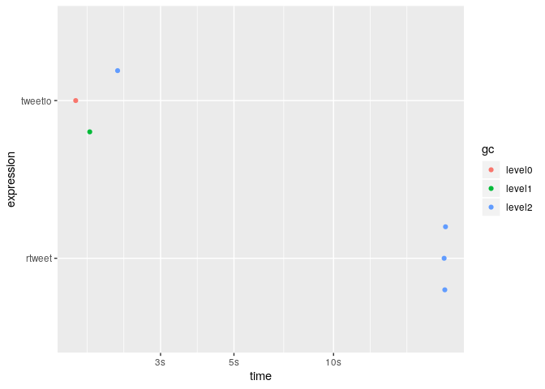

<!-- README.Rmd generates README.md. -->

# `{tweetio}`

<!-- badges: start -->

[](https://cran.r-project.org/package=tweetio)
[](https://www.tidyverse.org/lifecycle/#experimental)
[](https://github.com/knapply/tweetio/commits/master)
[](https://codecov.io/gh/knapply/tweetio?branch=master)
[](https://ci.appveyor.com/project/knapply/tweetio)
[](https://travis-ci.org/knapply/tweetio)
[](https://www.gnu.org/licenses/gpl-3.0)
[](https://www.r-project.org/)
[](https://github.com/knapply/tweetio)
[](http://hits.dwyl.io/knapply/tweetio)
<!-- badges: end -->

# Progress

### Supported Data Inputs

  - [x] Twitter API streams: .json, .json.gz
  - [x] API to Elasticsearch data dump (JSON Array): .json, .json.gz
  - [x] API to Elasticsearch data dump (line-delimited JSON): .jsonl,
    .jsonl.gz

### Supported Data Outputs

  - [x] CSV
  - [x] Excel
  - [x] Gephi-friendly GraphML

### Structures

  - [x] `{rtweet}`-style data frames
  - [x] Spatial Tweets via `{sf}`
  - [x] Tweet networks via `{igraph}`

# Introduction

`{tweetio}` goal is to enable safe, efficient I/O and transformation of
Twitter data. Whether the data came from the Twitter API, a database
dump, or some other source, `{tweetio}`’s job is to get them into R and
ready for analysis.

`{tweetio}` is **not** a competitor to `{rtweet}`: it is not interested
in collecting Twitter data. That said, it definitely attempts to emulate
its data frame schema because…

1.  It’s incredibly easy to use.
2.  It’s more efficient to analyze than a key-value format following the
    raw data.
3.  It’d be a waste not to maximize compatibiltiy with tools built
    specifically around `{rtweet}`’s data frames.

# Installation

You’ll need a C++ compiler. If you’re using Windows, that means
[Rtools](https://cran.r-project.org/bin/windows/Rtools/).

``` r
# install.packages("remotes")
remotes::install_github("knapply/tweetio")
```

# Usage

``` r
library(tweetio)
```

## Simple Example

First, we’ll save a stream of tweets using `rtweet::stream_tweets()`.

``` r
temp_file <- tempfile(fileext = ".json")
rtweet::stream_tweets(timeout = 15, parse = FALSE, file_name = temp_file)
```

We can then pass the file path to `tweetio::read_tweets()` to
efficiently parse the data into an `{rtweet}`-style data frame.

``` r
small_rtweet_stream <- read_tweets(temp_file, as_tibble = TRUE)

small_rtweet_stream
```

    #> # A tibble: 495 x 93
    #>    user_id status_id created_at          screen_name text  source reply_to_status~ reply_to_user_id reply_to_screen~
    #>    <chr>   <chr>     <dttm>              <chr>       <chr> <chr>  <chr>            <chr>            <chr>           
    #>  1 353747~ 12010036~ 2019-12-01 05:02:42 leiiisilva  Grab~ Twitt~ <NA>             <NA>             <NA>            
    #>  2 500994~ 12010036~ 2019-12-01 05:02:42 UofA_AugVi~ MBB:~ Twitt~ <NA>             <NA>             <NA>            
    #>  3 438789~ 12010036~ 2019-12-01 05:02:43 Dumb_bab    RT @~ Twitt~ <NA>             <NA>             <NA>            
    #>  4 903478~ 12010036~ 2019-12-01 05:02:43 fullsunflo~ kage~ Twitt~ <NA>             <NA>             <NA>            
    #>  5 113295~ 12010036~ 2019-12-01 05:02:43 jaIsbV7bZa~ "RT ~ Twitt~ <NA>             <NA>             <NA>            
    #>  6 117905~ 12010036~ 2019-12-01 05:02:43 jinsei8148  @591~ Twitt~ 120100187262395~ 2982659066       5917bm          
    #>  7 330017~ 12010036~ 2019-12-01 05:02:43 StevenLam29 RT @~ Twitt~ <NA>             <NA>             <NA>            
    #>  8 782127~ 12010036~ 2019-12-01 05:02:43 jkxbangtann RT @~ Twitt~ <NA>             <NA>             <NA>            
    #>  9 976364~ 12010036~ 2019-12-01 05:02:43 KKBADIN     RT @~ Twitt~ <NA>             <NA>             <NA>            
    #> 10 893878~ 12010036~ 2019-12-01 05:02:43 jiwon_peach RT @~ Twitt~ <NA>             <NA>             <NA>            
    #> # ... with 485 more rows, and 84 more variables: is_quote <lgl>, is_retweet <lgl>, hashtags <list>,
    #> #   urls_expanded_url <list>, media_url <list>, media_expanded_url <list>, media_type <list>, mentions_user_id <list>,
    #> #   mentions_screen_name <list>, lang <chr>, quoted_status_id <chr>, quoted_text <chr>, quoted_created_at <dttm>,
    #> #   quoted_source <chr>, quoted_favorite_count <int>, quoted_retweet_count <int>, quoted_user_id <chr>,
    #> #   quoted_screen_name <chr>, quoted_name <chr>, quoted_followers_count <int>, quoted_friends_count <int>,
    #> #   quoted_statuses_count <int>, quoted_location <chr>, quoted_description <chr>, quoted_verified <lgl>,
    #> #   retweet_status_id <chr>, retweet_text <chr>, retweet_created_at <dttm>, retweet_source <chr>,
    #> #   retweet_favorite_count <int>, retweet_retweet_count <int>, retweet_user_id <chr>, retweet_screen_name <chr>,
    #> #   retweet_name <chr>, retweet_followers_count <int>, retweet_friends_count <int>, retweet_statuses_count <int>,
    #> #   retweet_location <chr>, retweet_description <chr>, retweet_verified <lgl>, place_url <chr>, place_name <chr>,
    #> #   place_full_name <chr>, place_type <chr>, country <chr>, country_code <chr>, bbox_coords <list>, status_url <chr>,
    #> #   name <chr>, location <chr>, description <chr>, url <chr>, protected <lgl>, followers_count <int>,
    #> #   friends_count <int>, listed_count <int>, statuses_count <int>, favourites_count <int>, account_created_at <dttm>,
    #> #   verified <lgl>, profile_url <chr>, account_lang <chr>, profile_banner_url <chr>, profile_image_url <chr>,
    #> #   is_retweeted <lgl>, retweet_place_url <chr>, retweet_place_name <chr>, retweet_place_full_name <chr>,
    #> #   retweet_place_type <chr>, retweet_country <chr>, retweet_country_code <chr>, retweet_bbox_coords <list>,
    #> #   quoted_place_url <chr>, quoted_place_name <chr>, quoted_place_full_name <chr>, quoted_place_type <chr>,
    #> #   quoted_country <chr>, quoted_country_code <chr>, quoted_bbox_coords <list>, timestamp_ms <dttm>,
    #> #   contributors_enabled <lgl>, retweet_status_url <chr>, quoted_tweet_url <chr>, reply_to_status_url <chr>

## Scaling Up

We’re more interested in handling much larger data sets, but for
demonstration we’ll use a file of a reasonable size that was obtained
using `rtweet::stream_tweets()`.

``` r
rtweet_stream_path <- "inst/example-data/api-stream.json.gz"

scales::number_bytes(file.size(rtweet_stream_path))
```

    #> [1] "18 MiB"

Before compression, the file was about 153 Mb.

Unfortunately, `rtweet::parse_stream()` may fail parsing streams because
the data returned may not be valid JSON.

``` r
rtweet::parse_stream(rtweet_stream_path)
```

    #> Error: parse error: after array element, I expect ',' or ']'
    #>           736405012481"},"timestamp_ms":"1569693801061"}}{"created_at"
    #>                      (right here) ------^

The only way around this is to read the entire file into memory and run
some validation routine before parsing, which looks something like this…

``` r
rtweet_validate_and_parse <- function(source_file_path, target_file_path) {
  raw_lines <- readLines(source_file_path)
  valid_lines <- raw_lines[vapply(raw_lines, jsonify::validate_json, logical(1L))]
  writeLines(valid_lines, target_file_path)
  
  rtweet::parse_stream(target_file_path)
}

rtweet_stream_path2 <- tempfile(fileext = ".json")

rtweet_validate_and_parse(source_file_path = rtweet_stream_path, 
                          target_file_path = rtweet_stream_path2)
```

    #> # A tibble: 12,824 x 90
    #>    user_id status_id created_at          screen_name text  source display_text_wi~ reply_to_status~ reply_to_user_id
    #>    <chr>   <chr>     <dttm>              <chr>       <chr> <chr>             <dbl> <chr>            <chr>           
    #>  1 807195~ 11780078~ 2019-09-28 18:05:23 ykaoi0327   "<U+4EE5><U+4E0A><U+3067>~ Twitt~               NA <NA>             <NA>            
    #>  2 114393~ 11780078~ 2019-09-28 18:05:23 yowasugi723 "@Di~ Twitt~                9 117771450591824~ 113811437998190~
    #>  3 247059~ 11780078~ 2019-09-28 18:05:23 itsauroras~ "“So~ Twitt~               NA <NA>             <NA>            
    #>  4 822602~ 11780078~ 2019-09-28 18:05:23 Darrell894~ It's~ Twitt~               NA <NA>             <NA>            
    #>  5 797200~ 11780078~ 2019-09-28 18:05:23 NastyWoman~ @Bra~ Twitt~               69 117796816033668~ 21833728        
    #>  6 110779~ 11780078~ 2019-09-28 18:05:23 DeshaunAwe~ met ~ twitt~               NA <NA>             <NA>            
    #>  7 110441~ 11780078~ 2019-09-28 18:05:23 diamondy_u  "<U+2728>Lo~ Twitt~               NA <NA>             <NA>            
    #>  8 359294~ 11780078~ 2019-09-28 18:05:23 piyakat28   "Saf~ Twitt~               NA <NA>             <NA>            
    #>  9 194250~ 11780078~ 2019-09-28 18:05:23 Stgo_centro Me d~ Twitt~               NA <NA>             <NA>            
    #> 10 116013~ 11780078~ 2019-09-28 18:05:23 119lonwi_y~ <U+D55C><U+AD6D><U+C5D0><U+C11C>~ Twitt~               NA <NA>             <NA>            
    #> # ... with 12,814 more rows, and 81 more variables: reply_to_screen_name <chr>, is_quote <lgl>, is_retweet <lgl>,
    #> #   favorite_count <int>, retweet_count <int>, quote_count <int>, reply_count <int>, hashtags <list>, symbols <list>,
    #> #   urls_url <list>, urls_t.co <list>, urls_expanded_url <list>, media_url <list>, media_t.co <list>,
    #> #   media_expanded_url <list>, media_type <list>, ext_media_url <list>, ext_media_t.co <list>,
    #> #   ext_media_expanded_url <list>, ext_media_type <chr>, mentions_user_id <list>, mentions_screen_name <list>,
    #> #   lang <chr>, quoted_status_id <chr>, quoted_text <chr>, quoted_created_at <dttm>, quoted_source <chr>,
    #> #   quoted_favorite_count <int>, quoted_retweet_count <int>, quoted_user_id <chr>, quoted_screen_name <chr>,
    #> #   quoted_name <chr>, quoted_followers_count <int>, quoted_friends_count <int>, quoted_statuses_count <int>,
    #> #   quoted_location <chr>, quoted_description <chr>, quoted_verified <lgl>, retweet_status_id <chr>,
    #> #   retweet_text <chr>, retweet_created_at <dttm>, retweet_source <chr>, retweet_favorite_count <int>,
    #> #   retweet_retweet_count <int>, retweet_user_id <chr>, retweet_screen_name <chr>, retweet_name <chr>,
    #> #   retweet_followers_count <int>, retweet_friends_count <int>, retweet_statuses_count <int>, retweet_location <chr>,
    #> #   retweet_description <chr>, retweet_verified <lgl>, place_url <chr>, place_name <chr>, place_full_name <chr>,
    #> #   place_type <chr>, country <chr>, country_code <chr>, geo_coords <list>, coords_coords <list>, bbox_coords <list>,
    #> #   status_url <chr>, name <chr>, location <chr>, description <chr>, url <chr>, protected <lgl>, followers_count <int>,
    #> #   friends_count <int>, listed_count <int>, statuses_count <int>, favourites_count <int>, account_created_at <dttm>,
    #> #   verified <lgl>, profile_url <chr>, profile_expanded_url <chr>, account_lang <lgl>, profile_banner_url <chr>,
    #> #   profile_background_url <chr>, profile_image_url <chr>

Fortunately, `{tweetio}` can handle these situations by validating the
JSON before it gets anywhere near R.

``` r
bench::mark(
  read_tweets(rtweet_stream_path),
  min_iterations = 3
)[, 1:9]
```

    #> # A tibble: 1 x 6
    #>   expression                           min   median `itr/sec` mem_alloc `gc/sec`
    #>   <bch:expr>                      <bch:tm> <bch:tm>     <dbl> <bch:byt>    <dbl>
    #> 1 read_tweets(rtweet_stream_path)    3.21s    3.26s     0.303     136MB     1.01

Ignoring the time it takes to run the above
`rtweet_validate_and_parse()` function for `rtweet::parse_stream()` to
work, how much faster is `tweetio::read_tweets()`?

``` r
bench_mark <- bench::mark(
  rtweet = rtweet::parse_stream(rtweet_stream_path2),
  tweetio = tweetio::read_tweets(rtweet_stream_path2),
  check = FALSE,
  min_iterations = 3,
  filter_gc = FALSE
)

bench_mark[, 1:9]
```

    #> # A tibble: 2 x 6
    #>   expression      min   median `itr/sec` mem_alloc `gc/sec`
    #>   <bch:expr> <bch:tm> <bch:tm>     <dbl> <bch:byt>    <dbl>
    #> 1 rtweet       25.95s   26.62s    0.0379     480MB     4.54
    #> 2 tweetio       2.56s    2.69s    0.362       95MB     1.33

``` r
plot(bench_mark)
```



With bigger files, using `rtweet::parse_stream()` is no longer
realistic, but that’s where `tweetio::read_tweets()` can help.

``` r
big_tweet_stream_path <- "~/ufc-tweet-stream.json.gz"
scales::number_bytes(file.size(big_tweet_stream_path)) # 1.2 Gb before compression
```

    #> [1] "122 MiB"

``` r
bench::mark(
  big_tweet_df <- tweetio::read_tweets(big_tweet_stream_path)
)[, 1:9]
```

    #> # A tibble: 1 x 6
    #>   expression                                                       min   median `itr/sec` mem_alloc `gc/sec`
    #>   <bch:expr>                                                  <bch:tm> <bch:tm>     <dbl> <bch:byt>    <dbl>
    #> 1 big_tweet_df <- tweetio::read_tweets(big_tweet_stream_path)    20.2s    20.2s    0.0495     396MB    0.347

## Data Dumps

A common practice for handling social media data at scale is to store
them in search engine databases like Elasticsearch, but it’s
(unfortunately) possible that you’ll need to work with data dumps.

The data collected from APIs are stored inside a nested JSON object
named `"doc"`. `"doc"` is typically embedded in a ton of system
metadata, most of which you probably don’t care about.

I’ve encountered two flavors of these schema:

1.  .jsonl: newline-delimited JSON
2.  .json: the complete contents of a database dump packed in a JSON
    array

The .jsonl structure looks something like this:

``` json
{"system_metadata_you_dont_care_about":"blahblahblah","more_metadata1":"blahblahblah","more_metadata2":"blahblahblah","more_metadata3":"blahblahblah","more_metadata4":"blahblahblah","more_metadata5":"blahblahblah","doc":{"text":"********************HERE'S THE DATA YOU ACTUALLY WANT********************","id":92108498098018010401,"id_str":"92108498098018010401"},"more_metadata6":"blahblahblah","more_metadata7":"blahblahblah","more_metadata8":"blahblahblah","more_metadata9":"blahblahblah","more_metadata10":"blahblahblah"}
{"system_metadata_you_dont_care_about":"blahblahblah","more_metadata1":"blahblahblah","more_metadata2":"blahblahblah","more_metadata3":"blahblahblah","more_metadata4":"blahblahblah","more_metadata5":"blahblahblah","doc":{"text":"********************HERE'S THE DATA YOU ACTUALLY WANT********************","id":92108498098018010401,"id_str":"92108498098018010401"},"more_metadata6":"blahblahblah","more_metadata7":"blahblahblah","more_metadata8":"blahblahblah","more_metadata9":"blahblahblah","more_metadata10":"blahblahblah"}
{"system_metadata_you_dont_care_about":"blahblahblah","more_metadata1":"blahblahblah","more_metadata2":"blahblahblah","more_metadata3":"blahblahblah","more_metadata4":"blahblahblah","more_metadata5":"blahblahblah","doc":{"text":"********************HERE'S THE DATA YOU ACTUALLY WANT********************","id":92108498098018010401,"id_str":"92108498098018010401"},"more_metadata6":"blahblahblah","more_metadata7":"blahblahblah","more_metadata8":"blahblahblah","more_metadata9":"blahblahblah","more_metadata10":"blahblahblah"}
```

Each line contains a single JSON object resembling the following:

``` json
{
    "system_metadata_you_dont_care_about": "blahblahblah",
    "more_metadata1": "blahblahblah",
    "more_metadata2": "blahblahblah",
    "more_metadata3": "blahblahblah",
    "more_metadata4": "blahblahblah",
    "more_metadata5": "blahblahblah",
    "doc": {
        "text": "********************HERE'S THE DATA YOU ACTUALLY WANT********************",
        "id": 92108498098018010401,
        "id_str": "92108498098018010401"
    },
    "more_metadata6": "blahblahblah",
    "more_metadata7": "blahblahblah",
    "more_metadata8": "blahblahblah",
    "more_metadata9": "blahblahblah",
    "more_metadata10": "blahblahblah"
}
```

The array structure is a complete dump of the file, which looks
something like this:

``` json
[
    {
        "_id": "e5daf1467d2438e31b11b44a82cbd7f5758ba5a1f1d3ecbcc6e1fc04dc9c7c4d-3016858092318",
        "_index": "org-77f135f331153568ab7eb0e4c24623a7-default-3769a33b9e88598e38317591e2ee31c3-default-030009",
        "_score": null,
        "_source": {
            "system_metadata_you_dont_care_about": "blahblahblah",
            "more_metadata1": "blahblahblah",
            "doc": {
                "text": "********************HERE'S THE DATA YOU ACTUALLY WANT********************",
                "id": 92108498098018010401,
                "id_str": "92108498098018010401"
            },
            "more_metadata6": "blahblahblah"
        }
    },
    {
        "_id": "e5daf1467d2438e31b11b44a82cbd7f5758ba5a1f1d3ecbcc6e1fc04dc9c7c4d-3016858092318",
        "_index": "org-77f135f331153568ab7eb0e4c24623a7-default-3769a33b9e88598e38317591e2ee31c3-default-030009",
        "_score": null,
        "_source": {
            "system_metadata_you_dont_care_about": "blahblahblah",
            "more_metadata1": "blahblahblah",
            "doc": {
                "text": "********************HERE'S THE DATA YOU ACTUALLY WANT********************",
                "id": 92108498098018010401,
                "id_str": "92108498098018010401"
            },
            "more_metadata6": "blahblahblah"
        }
    }
]
```

This has three unfortunate consequences:

1.  Packages that were purpose-built to work directly with `{rtweet}`’s
    data frames can’t play along with your data.
2.  You’re going to waste most of your time (and memory) getting data
    into R that you’re not going to use.
3.  The data are *very* tedious to restructure in R (lists of lists of
    lists of lists of lists…).

`{tweetio}` solves this by parsing everything and building the data
frames at the C++ level.

# Spatial Tweets

If you have `{sf}` installed, you can use `as_tweet_sf()` to only keep
those tweets that contain valid bounding box polygons.

``` r
tweet_sf <- as_tweet_sf(tweet_df = big_tweet_df) 

tweet_sf[, "bbox_coords"]
```

    #> Simple feature collection with 2204 features and 0 fields
    #> geometry type:  POLYGON
    #> dimension:      XY
    #> bbox:           xmin: -158.048 ymin: -50.35726 xmax: 175.5507 ymax: 61.4262
    #> epsg (SRID):    4326
    #> proj4string:    +proj=longlat +datum=WGS84 +no_defs
    #> First 10 features:
    #>                       bbox_coords
    #> 1  POLYGON ((-90.23761 29.9683...
    #> 2  POLYGON ((-80.20811 26.0809...
    #> 3  POLYGON ((17.08005 59.73069...
    #> 4  POLYGON ((-80.51985 39.7198...
    #> 5  POLYGON ((-80.34364 25.5991...
    #> 6  POLYGON ((-118.6684 33.7045...
    #> 7  POLYGON ((-122.0662 37.9242...
    #> 8  POLYGON ((-118.4485 33.9768...
    #> 9  POLYGON ((-97.66262 27.5785...
    #> 10 POLYGON ((-118.6684 33.7045...

There are currently three columns that can potentially hold bounding
boxes:

1.  `bbox_coords`
2.  `quoted_bbox_coords`
3.  `retweet_bbox_coords`

You can select which one to use to build your `sf` object by modifying
the `geom_col=` parameter (default: `"bbox_coords"`)

``` r
as_tweet_sf(big_tweet_df, geom_col = "quoted_bbox_coords"
            )[, "quoted_bbox_coords"]
```

    #> Simple feature collection with 1254 features and 0 fields
    #> geometry type:  POLYGON
    #> dimension:      XY
    #> bbox:           xmin: -124.849 ymin: -27.76744 xmax: 153.3179 ymax: 60.29791
    #> epsg (SRID):    4326
    #> proj4string:    +proj=longlat +datum=WGS84 +no_defs
    #> First 10 features:
    #>                quoted_bbox_coords
    #> 1  POLYGON ((-73.99354 40.7507...
    #> 2  POLYGON ((-73.99354 40.7507...
    #> 3  POLYGON ((-73.99354 40.7507...
    #> 4  POLYGON ((-73.99354 40.7507...
    #> 5  POLYGON ((-73.99354 40.7507...
    #> 6  POLYGON ((-73.99354 40.7507...
    #> 7  POLYGON ((-73.99354 40.7507...
    #> 8  POLYGON ((-73.99354 40.7507...
    #> 9  POLYGON ((-73.99354 40.7507...
    #> 10 POLYGON ((-73.99354 40.7507...

You can also build *all* the supported bounding boxes by setting
`geom_col=` to `"all"`.

``` r
all_bboxes <- as_tweet_sf(big_tweet_df, geom_col = "all")
all_bboxes[, c("geometry", "which_geom")]
```

    #> Simple feature collection with 7428 features and 1 field
    #> geometry type:  POLYGON
    #> dimension:      XY
    #> bbox:           xmin: -158.048 ymin: -50.35726 xmax: 175.5507 ymax: 61.4262
    #> epsg (SRID):    4326
    #> proj4string:    +proj=longlat +datum=WGS84 +no_defs
    #> First 10 features:
    #>                          geometry  which_geom
    #> 1  POLYGON ((-90.23761 29.9683... bbox_coords
    #> 2  POLYGON ((-80.20811 26.0809... bbox_coords
    #> 3  POLYGON ((17.08005 59.73069... bbox_coords
    #> 4  POLYGON ((-80.51985 39.7198... bbox_coords
    #> 5  POLYGON ((-80.34364 25.5991... bbox_coords
    #> 6  POLYGON ((-118.6684 33.7045... bbox_coords
    #> 7  POLYGON ((-122.0662 37.9242... bbox_coords
    #> 8  POLYGON ((-118.4485 33.9768... bbox_coords
    #> 9  POLYGON ((-97.66262 27.5785... bbox_coords
    #> 10 POLYGON ((-118.6684 33.7045... bbox_coords

``` r
unique(all_bboxes$which_geom)
```

    #> [1] "bbox_coords"         "quoted_bbox_coords"  "retweet_bbox_coords"

From there, you can easily use the data like any other `{sf}` object.

``` r
library(ggplot2)

world <- rnaturalearth::ne_countries(returnclass = "sf")
world <- world[world$continent != "Antarctica", ]

sf_for_gg <- sf::st_wrap_dateline(all_bboxes)

ggplot(sf_for_gg) +
  geom_sf(fill = "white", color = "lightgray", data = world) +
  geom_sf(aes(fill = which_geom, color = which_geom), alpha = 0.15, size = 1, show.legend = TRUE) +
  coord_sf(crs = 3857) +
  scale_fill_viridis_d() +
  scale_color_viridis_d() +
  theme(legend.title = element_blank(), legend.position = "top",
        panel.background = element_rect(fill = "#daf3ff"))
```


# Tweet Networks

If you want to analyze tweet networks, you can get started immediately
using `tweetio::as_igraph()`.

``` r
big_tweet_df %>%
  as_igraph()
```

    #> IGRAPH 73546af DN-- 64172 238713 -- 
    #> + attr: name (v/c), status_id (e/c), relation (e/c)
    #> + edges from 73546af (vertex names):
    #>  [1] 340165454          ->44607937            50229830           ->146322653          
    #>  [3] 1113359075029295106->6446742             3427037277         ->6446742            
    #>  [5] 2426567863         ->6446742             1049130232559620096->6446742            
    #>  [7] 54342307           ->45882011            850484615978602496 ->6446742            
    #>  [9] 3223860438         ->1082759930338258944 1128691062225219584->327117944          
    #> [11] 158942796          ->1148290116349095936 421186669          ->1062738433716686848
    #> [13] 781608484257214464 ->6446742             2519063076         ->146322653          
    #> [15] 361935609          ->6446742             822180925467398148 ->32522055           
    #> + ... omitted several edges

If you want to take advantage of all the metadata available, you can set
`all_status_data` and/or `all_user_data` to `TRUE`

``` r
big_tweet_df %>% 
  as_igraph(all_user_data = TRUE, all_status_data = TRUE)
```

    #> IGRAPH 7a8d376 DN-- 64172 238713 -- 
    #> + attr: name (v/c), timestamp_ms (v/n), name.y (v/c), screen_name (v/c), location (v/c), description (v/c),
    #> | url (v/c), protected (v/l), followers_count (v/n), friends_count (v/n), listed_count (v/n),
    #> | statuses_count (v/n), favourites_count (v/n), account_created_at (v/n), verified (v/l), profile_url
    #> | (v/c), account_lang (v/c), profile_banner_url (v/c), profile_image_url (v/c), bbox_coords (v/x),
    #> | status_id (e/c), relation (e/c), created_at (e/n), text (e/c), status_url (e/c), source (e/c), is_quote
    #> | (e/l), is_retweeted (e/l), media_url (e/x), media_type (e/x), place_url (e/c), place_name (e/c),
    #> | place_full_name (e/c), place_type (e/c), country (e/c), country_code (e/c), bbox_coords (e/x),
    #> | status_type (e/c)
    #> + edges from 7a8d376 (vertex names):
    #> [1] 2547690569->6446742  2547690569->6446742  245171523 ->52181976
    #> + ... omitted several edges

You can also build two-mode networks by specifying the `target_class` as
`"hashtag"`s, `"url"`s, or `"media"`. The returned `<igraph>` will be
set as bipartite following `{igraph}`’s convention of a `logical` vertex
attribute specifying each’s partition (users are `TRUE`).

``` r
big_tweet_df %>% 
  as_igraph(target_class = "hashtag")
```

    #> IGRAPH 7b8a101 DN-B 60417 134468 -- 
    #> + attr: name (v/c), type (v/l), status_id (e/c), relation (e/c)
    #> + edges from 7b8a101 (vertex names):
    #>  [1] 340165454          ->ufc244 50229830           ->new    50229830           ->ufc244 1113359075029295106->ufc244
    #>  [5] 1120821278410145793->ufc244 2945072804         ->ufc244 250392181          ->ufc244 3427037277         ->ufc244
    #>  [9] 2426567863         ->ufc244 1049130232559620096->ufc244 245455601          ->ufc244 895707290          ->ufc244
    #> [13] 767474462254108674 ->ufc244 69783385           ->ufc244 850484615978602496 ->ufc244 3223860438         ->ufc244
    #> [17] 518350072          ->ufc244 1128691062225219584->ufc244 158942796          ->ufc244 421186669          ->ufc244
    #> [21] 781608484257214464 ->ufc244 854129173937491968 ->ufc244 2519063076         ->new    2519063076         ->ufc244
    #> [25] 361935609          ->ufc244 822180925467398148 ->ufc244 1107856314875695105->ufc244 766650582409109505 ->ufc244
    #> [29] 1401244394         ->new    1401244394         ->ufc244 452637226          ->ufc244 110374459          ->ufc244
    #> + ... omitted several edges

``` r
big_tweet_df %>% 
  as_igraph(target_class = "url")
```

    #> IGRAPH 7bb0f77 DN-B 8864 10014 -- 
    #> + attr: name (v/c), type (v/l), status_id (e/c), relation (e/c)
    #> + edges from 7bb0f77 (vertex names):
    #> [1] 54342307           ->https://twitter.com/jjmast1/status/1190812770951925760      
    #> [2] 822180925467398148 ->https://twitter.com/usatoday/status/1190848577171529729     
    #> [3] 1161588424488341504->https://livestreamon.co/ufc244                              
    #> [4] 1020289868231036929->https://twitter.com/sososfm/status/1190817388176035840      
    #> [5] 222715765          ->http://is.gd/BDIHaF                                         
    #> [6] 700295730          ->https://twitter.com/Karlos_ch/status/1190830330703499266    
    #> [7] 1174700278769225730->https://twitter.com/mitchhorowitz/status/1190809746347085824
    #> + ... omitted several edges

``` r
big_tweet_df %>% 
  as_igraph(target_class = "media")
```

    #> IGRAPH 7c0c59b DN-B 35704 45448 -- 
    #> + attr: name (v/c), type (v/l), status_id (e/c), relation (e/c)
    #> + edges from 7c0c59b (vertex names):
    #> [1] 1113359075029295106->http://pbs.twimg.com/tweet_video_thumb/EIa_t4bXYAEFVGR.jpg                             
    #> [2] 3427037277         ->http://pbs.twimg.com/tweet_video_thumb/EIa_t4bXYAEFVGR.jpg                             
    #> [3] 2426567863         ->http://pbs.twimg.com/tweet_video_thumb/EIa_t4bXYAEFVGR.jpg                             
    #> [4] 1049130232559620096->http://pbs.twimg.com/tweet_video_thumb/EIa_t4bXYAEFVGR.jpg                             
    #> [5] 767474462254108674 ->http://pbs.twimg.com/tweet_video_thumb/EIa_-hyX0AA7j1o.jpg                             
    #> [6] 850484615978602496 ->http://pbs.twimg.com/media/EIa--ZTXUAEP7PH.jpg                                         
    #> [7] 3223860438         ->http://pbs.twimg.com/tweet_video_thumb/EIa_t4bXYAEFVGR.jpg                             
    #> [8] 158942796          ->http://pbs.twimg.com/ext_tw_video_thumb/1190817246110720000/pu/img/jw75ZV3YmtL2PgXT.jpg
    #> + ... omitted several edges

You’re not stuck with going directly to `<igraph>` objects though.
Underneath the hood, `as_igraph()` calls `as_proto_net()`, which builds
the edge and node data frames first. `as_proto_net()` is also exported.

``` r
big_tweet_df %>% 
  as_proto_net(all_status_data = TRUE, all_user_data = TRUE, as_tibble = TRUE)
```

    #> $edges
    #> # A tibble: 238,713 x 20
    #>    from  to    status_id relation created_at          text  status_url source is_quote is_retweeted media_url media_type
    #>    <chr> <chr> <chr>     <chr>    <dttm>              <chr> <chr>      <chr>  <lgl>    <lgl>        <list>    <list>    
    #>  1 2547~ 6446~ 11908873~ retweet  2019-11-03 07:03:55 "RT ~ https://t~ Twitt~ FALSE    FALSE        <chr [1]> <chr [1]> 
    #>  2 2547~ 6446~ 11908873~ mentions 2019-11-03 07:03:55 "RT ~ https://t~ Twitt~ FALSE    FALSE        <chr [1]> <chr [1]> 
    #>  3 2451~ 5218~ 11908873~ mentions 2019-11-03 07:03:55 “Fu@~ https://t~ Twitt~ FALSE    FALSE        <chr [1]> <chr [1]> 
    #>  4 8062~ 1463~ 11908873~ retweet  2019-11-03 07:03:55 RT @~ https://t~ Twitt~ FALSE    FALSE        <chr [1]> <chr [1]> 
    #>  5 8062~ 1463~ 11908873~ mentions 2019-11-03 07:03:55 RT @~ https://t~ Twitt~ FALSE    FALSE        <chr [1]> <chr [1]> 
    #>  6 8045~ 4588~ 11908873~ retweet  2019-11-03 07:03:55 RT @~ https://t~ Twitt~ TRUE     FALSE        <chr [1]> <chr [1]> 
    #>  7 8045~ 3934~ 11908873~ quoted   2019-11-03 07:03:55 RT @~ https://t~ Twitt~ TRUE     FALSE        <chr [1]> <chr [1]> 
    #>  8 8045~ 4588~ 11908873~ mentions 2019-11-03 07:03:55 RT @~ https://t~ Twitt~ TRUE     FALSE        <chr [1]> <chr [1]> 
    #>  9 2973~ 8174~ 11908873~ retweet  2019-11-03 07:03:55 RT @~ https://t~ Twitt~ TRUE     FALSE        <chr [1]> <chr [1]> 
    #> 10 2973~ 7776~ 11908873~ quoted   2019-11-03 07:03:55 RT @~ https://t~ Twitt~ TRUE     FALSE        <chr [1]> <chr [1]> 
    #> # ... with 238,703 more rows, and 8 more variables: place_url <chr>, place_name <chr>, place_full_name <chr>,
    #> #   place_type <chr>, country <chr>, country_code <chr>, bbox_coords <list>, status_type <chr>
    #> 
    #> $nodes
    #> # A tibble: 64,172 x 20
    #>    name  timestamp_ms        name.y screen_name location description url   protected followers_count friends_count
    #>    <chr> <dttm>              <chr>  <chr>       <chr>    <chr>       <chr> <lgl>               <int>         <int>
    #>  1 1000~ 2019-11-03 04:53:06 <U+1D07><U+029F> <U+1D0A><U+1D1C>~ Urbeaner_   Colorad~ "UCCS ‘21 ~ <NA>  FALSE                 158           250
    #>  2 1000~ 2019-11-03 05:24:27 adrie~ a2rien_     "DTM \U~ <NA>        <NA>  FALSE                 161           124
    #>  3 1000~ 2019-11-03 05:08:38 Adee   SailorSlim  Freepor~ Instagram:~ <NA>  FALSE                  54            24
    #>  4 1000~ 2019-11-03 06:09:47 Khair~ Jenklens_   209      "26. Marri~ http~ FALSE                1977          1622
    #>  5 1000~ 2019-11-03 05:13:37 me, m~ Amanda8728~ "Usa "   take your ~ <NA>  FALSE                  28           243
    #>  6 1000~ 2019-11-03 04:49:04 hoodi~ eghoops1    htx      shoot hoop~ http~ FALSE                 838           258
    #>  7 1000~ 2019-11-03 05:19:56 Dylan~ CieslikDyl~ Oak Rid~ Aspiring B~ <NA>  FALSE                  38           137
    #>  8 1000~ 2019-11-03 06:17:14 "Tony~ tonystinks~ <NA>     Sc: tonyst~ <NA>  FALSE                  54            76
    #>  9 1000~ 2019-11-03 06:49:02 Pablo~ PabloEskiB~ London,~ "The one s~ <NA>  FALSE                 982           295
    #> 10 1000~ 2019-11-03 04:37:22 ThomT~ ThomThom715 <NA>     <NA>        <NA>  FALSE                   3            30
    #> # ... with 64,162 more rows, and 10 more variables: listed_count <int>, statuses_count <int>, favourites_count <int>,
    #> #   account_created_at <dttm>, verified <lgl>, profile_url <chr>, account_lang <chr>, profile_banner_url <chr>,
    #> #   profile_image_url <chr>, bbox_coords <list>
    #> 
    #> attr(,"class")
    #> [1] "proto_net"
    #> attr(,"target_class")
    #> [1] "user"

# Shout Outs

`{tweetio}` uses a combination of C++ via
[`{Rcpp}`](http://www.rcpp.org/), the
[`rapidjson`](http://rapidjson.org/) C++ library (made available by
[`{rapidjsonr}`](https://cran.r-project.org/web/packages/rapidjsonr/index.html)),
[`{jsonify}`](https://cran.r-project.org/web/packages/jsonify/index.html))
for an R-level interface to `rapidjson`,
[`{RcppProgress}`](https://cran.r-project.org/web/packages/RcppProgress/index.html)),
and **R’s secret weapon**:
[`{data.table}`](https://rdatatable.gitlab.io/data.table/).

Major inspiration from [`{ndjson}`](https://gitlab.com/hrbrmstr/ndjson)
was taken, particularly its use of
[`Gzstream`](https://www.cs.unc.edu/Research/compgeom/gzstream/).
