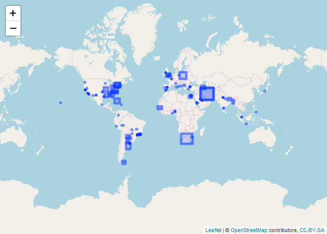

<!-- README.Rmd generates README.md. -->

# `{tweetio}`

<!-- badges: start -->

[](https://www.tidyverse.org/lifecycle/#experimental)
[](https://github.com/knapply/tweetio/commits/master)
[](https://codecov.io/gh/knapply/tweetio?branch=master)
[](https://ci.appveyor.com/project/knapply/tweetio)
[](https://travis-ci.org/knapply/tweetio)
[](https://www.gnu.org/licenses/gpl-3.0)
[](https://www.r-project.org/)
[](https://github.com/knapply/tweetio)
[](http://hits.dwyl.io/knapply/tweetio)
<!-- badges: end -->

# Progress

### Supported Data Inputs

  - [x] Twitter API streams: .json, .json.gz
  - [x] API to Elasticsearch data dump (JSON Array): .json, .json.gz
  - [x] API to Elasticsearch data dump (line-delimited JSON): .jsonl,
    .jsonl.gz

### Supported Data Outputs

  - [x] .graphml, currently available in
    [`{tweetgraph}`](https://knapply.github.io/tweetgraph/)
  - [ ] CSV (will likely be CSVY once `{data.table}`’s `fread(yaml =
    TRUE)` feature stabilizes)

### Extras

  - [x] Spatial Tweets via `tweetio::as_tweet_sf()`

# Introduction

**The [`{rtweet}`](https://rtweet.info/) package spoils R users
*rotten*… in the best possible way**. The behind-the-scenes data
carpentry is so seamless that the user doesn’t need to know anything
about the horrors of Twitter data, which is pretty amazing. If you use
`{rtweet}`, you owe Mike Kearney some serious gratitude/citations.

`{tweetio}` is **not** a competitor to `{rtweet}`, but it definitely
attempts to emulate its data frame schema because…

1.  It’s incredibly easy to use.
2.  It’s more efficient to analyze than a key-value format following the
    raw data.
3.  It’d be a waste not to maximize compatibiltiy with tools built
    specifically around `{rtweet}`’s data frames.

> ***You** bring the tweets, `{tweetio}` gets them into R.*

`{tweetio}` (mainly) focuses on one thing: **going from raw tweets to
`{rtweet}`-style data frames (or other useful structures) as quickly and
efficiently as possible**. Whether the data came from the Twitter API, a
database dump, or some other source, `{tweetio}`’s job is to get them
into R.

# Installation

You’ll need a C++ compiler. You can check if you’re ready to go by
running the following code:

``` r
# install.packages("pkgbuild")
pkgbuild::check_build_tools()
```

If you’re using Windows, you’ll need
[Rtools](https://cran.r-project.org/bin/windows/Rtools/).

You probably want to follow the page’s advice and select the recommended
version, which is currently Rtools35.exe. When you’re installing Rtools,
you need to make sure you check the box stating “Add rtools to system
PATH”.

I have needed to reboot every computer on which I’ve installed Rtools
before I could compile an R package.

Once you’re done, reboot. Then you can install `{tweetio}`.

``` r
# install.packages("remotes")
remotes::install_github("knapply/tweetio")
```

# Usage

## Simple Example

First, we’ll save a stream of tweets using `rtweet::stream_tweets()`.

``` r
temp_file <- tempfile(fileext = ".json")
rtweet::stream_tweets(timeout = 15, parse = FALSE, file_name = temp_file)
```

We can then pass the file path to `tweetio::read_tweets()` to
efficiently parse the data into an `{rtweet}`-style data frame.

``` r
library(tweetio)

small_rtweet_stream <- read_tweets(temp_file)
dplyr::glimpse(small_rtweet_stream)
```

    #> Observations: 460
    #> Variables: 87
    #> $ user_id                 <chr> "1187260058515603456", "2946355818", "...
    #> $ status_id               <chr> "1193259594451042304", "11932595944216...
    #> $ created_at              <dttm> 2019-11-09 20:10:31, 2019-11-09 20:10...
    #> $ screen_name             <chr> "bbot5forever", "eangnunchaya", "casar...
    #> $ text                    <chr> "Bigbang is the best runningman guest....
    #> $ source                  <chr> "<a href=\"http://twitter.com/download...
    #> $ reply_to_status_id      <chr> NA, NA, NA, NA, NA, NA, NA, NA, NA, NA...
    #> $ reply_to_user_id        <chr> NA, NA, NA, NA, NA, NA, NA, NA, NA, NA...
    #> $ reply_to_screen_name    <chr> NA, NA, NA, NA, NA, NA, NA, NA, NA, NA...
    #> $ is_quote                <lgl> FALSE, FALSE, FALSE, FALSE, FALSE, FAL...
    #> $ is_retweeted            <lgl> FALSE, FALSE, FALSE, FALSE, FALSE, FAL...
    #> $ hashtags                <list> [<>, <>, <>, <>, <>, <"URGENTE", "Bol...
    #> $ urls_expanded_url       <list> [<>, <>, <>, <>, <>, <>, <>, <>, <>, ...
    #> $ media_expanded_url      <list> [<>, <>, "https://twitter.com/cdzonan...
    #> $ media_url               <list> [<>, <>, "http://pbs.twimg.com/media/...
    #> $ media_type              <list> [<>, <>, "photo", "photo", "photo", <...
    #> $ mentions_user_id        <list> [<>, "2274558024", <"338255654", "110...
    #> $ mentions_screen_name    <list> [<>, "arielqueenss", <"cdzonanorte", ...
    #> $ lang                    <chr> "en", "th", "es", "ru", "en", "es", "p...
    #> $ quoted_status_id        <chr> NA, NA, NA, NA, NA, NA, NA, NA, NA, NA...
    #> $ quoted_text             <chr> NA, NA, NA, NA, NA, NA, NA, NA, NA, NA...
    #> $ quoted_created_at       <dttm> NA, NA, NA, NA, NA, NA, NA, NA, NA, N...
    #> $ quoted_source           <chr> NA, NA, NA, NA, NA, NA, NA, NA, NA, NA...
    #> $ quoted_favorite_count   <int> NA, NA, NA, NA, NA, NA, NA, NA, NA, NA...
    #> $ quoted_retweet_count    <int> NA, NA, NA, NA, NA, NA, NA, NA, NA, NA...
    #> $ quoted_user_id          <chr> NA, NA, NA, NA, NA, NA, NA, NA, NA, NA...
    #> $ quoted_screen_name      <chr> NA, NA, NA, NA, NA, NA, NA, NA, NA, NA...
    #> $ quoted_name             <chr> NA, NA, NA, NA, NA, NA, NA, NA, NA, NA...
    #> $ quoted_followers_count  <int> NA, NA, NA, NA, NA, NA, NA, NA, NA, NA...
    #> $ quoted_friends_count    <int> NA, NA, NA, NA, NA, NA, NA, NA, NA, NA...
    #> $ quoted_statuses_count   <int> NA, NA, NA, NA, NA, NA, NA, NA, NA, NA...
    #> $ quoted_location         <chr> NA, NA, NA, NA, NA, NA, NA, NA, NA, NA...
    #> $ quoted_description      <chr> NA, NA, NA, NA, NA, NA, NA, NA, NA, NA...
    #> $ quoted_verified         <lgl> TRUE, TRUE, TRUE, TRUE, TRUE, TRUE, TR...
    #> $ retweet_status_id       <chr> NA, "1193156780320120832", "1193181858...
    #> $ retweet_text            <chr> NA, "<U+0E19><U+0E35><U+0E48><U+0E04><U+0E37><U+0E2D><U+0E20><U+0E32><U+0E1E><U+0E2B><U+0E19><U+0E36><U+0E48><U+0E07><U+0E43><U+0E19> Concept art <U+0E41><U+0E23><U+0E01><U+0E40>...
    #> $ retweet_created_at      <dttm> NA, 2019-11-09 13:21:58, 2019-11-09 1...
    #> $ retweet_source          <chr> NA, "<a href=\"http://twitter.com/down...
    #> $ retweet_favorite_count  <int> NA, 1599, 2, 7, 93, 56, 36149, 2, 9273...
    #> $ retweet_retweet_count   <int> NA, 4443, 2, 3, 39, 53, 10051, 26, 335...
    #> $ retweet_user_id         <chr> NA, "2274558024", "338255654", "102969...
    #> $ retweet_screen_name     <chr> NA, "arielqueenss", "cdzonanorte", "sh...
    #> $ retweet_name            <chr> NA, "— \U0001d4d0\U0001d4fb\U0001d4f2\...
    #> $ retweet_followers_count <int> NA, 22733, 988, 434, 7839, 4117, 16487...
    #> $ retweet_friends_count   <int> NA, 22733, 988, 434, 7839, 4117, 16487...
    #> $ retweet_statuses_count  <int> NA, 32565, 2357, 6267, 366, 249094, 60...
    #> $ retweet_location        <chr> NA, "<U+0E01><U+0E23><U+0E38><U+0E07><U+0E40><U+0E17><U+0E1E><U+0E21><U+0E2B><U+0E32><U+0E19><U+0E04><U+0E23>, <U+0E1B><U+0E23><U+0E30><U+0E40><U+0E17><U+0E28><U+0E44><U+0E17><U+0E22>", "Ávila...
    #> $ retweet_description     <chr> NA, "stan MARVEL & DISNEY & QUEEN & BE...
    #> $ retweet_verified        <lgl> TRUE, FALSE, FALSE, FALSE, FALSE, FALS...
    #> $ place_url               <chr> NA, NA, NA, NA, NA, NA, NA, NA, NA, NA...
    #> $ place_name              <chr> NA, NA, NA, NA, NA, NA, NA, NA, NA, NA...
    #> $ place_full_name         <chr> NA, NA, NA, NA, NA, NA, NA, NA, NA, NA...
    #> $ place_type              <chr> NA, NA, NA, NA, NA, NA, NA, NA, NA, NA...
    #> $ country                 <chr> NA, NA, NA, NA, NA, NA, NA, NA, NA, NA...
    #> $ country_code            <chr> NA, NA, NA, NA, NA, NA, NA, NA, NA, NA...
    #> $ bbox_coords             <list> [<>, <>, <>, <>, <>, <>, <>, <>, <>, ...
    #> $ retweet_place_url       <chr> NA, NA, NA, NA, NA, NA, NA, NA, NA, NA...
    #> $ retweet_place_name      <chr> NA, NA, NA, NA, NA, NA, NA, NA, NA, NA...
    #> $ retweet_place_full_name <chr> NA, NA, NA, NA, NA, NA, NA, NA, NA, NA...
    #> $ retweet_place_type      <chr> NA, NA, NA, NA, NA, NA, NA, NA, NA, NA...
    #> $ retweet_country         <chr> NA, NA, NA, NA, NA, NA, NA, NA, NA, NA...
    #> $ retweet_country_code    <chr> NA, NA, NA, NA, NA, NA, NA, NA, NA, NA...
    #> $ retweet_bbox_coords     <list> [<>, <>, <>, <>, <>, <>, <>, <>, <>, ...
    #> $ quoted_place_url        <chr> NA, NA, NA, NA, NA, NA, NA, NA, NA, NA...
    #> $ quoted_place_name       <chr> NA, NA, NA, NA, NA, NA, NA, NA, NA, NA...
    #> $ quoted_place_full_name  <chr> NA, NA, NA, NA, NA, NA, NA, NA, NA, NA...
    #> $ quoted_place_type       <chr> NA, NA, NA, NA, NA, NA, NA, NA, NA, NA...
    #> $ quoted_country          <chr> NA, NA, NA, NA, NA, NA, NA, NA, NA, NA...
    #> $ quoted_country_code     <chr> NA, NA, NA, NA, NA, NA, NA, NA, NA, NA...
    #> $ quoted_bbox_coords      <list> [<>, <>, <>, <>, <>, <>, <>, <>, <>, ...
    #> $ name                    <chr> "SunDae FINALLY \U0001f47c\U0001f3fb\U...
    #> $ location                <chr> NA, "<U+0E2D>.<U+0E40><U+0E21><U+0E37><U+0E2D><U+0E07><U+0E1E><U+0E30><U+0E40><U+0E22><U+0E32>, <U+0E08>.<U+0E1E><U+0E30><U+0E40><U+0E22><U+0E32>", NA, "<U+0432> <U+0433><U+0440>...
    #> $ description             <chr> "your clown wig is falling honey #D1 u...
    #> $ url                     <chr> NA, NA, NA, "https://ficbook.net/autho...
    #> $ protected               <lgl> FALSE, FALSE, FALSE, FALSE, FALSE, FAL...
    #> $ followers_count         <int> 20, 161, 44, 705, 8, 853, 149, 105029,...
    #> $ friends_count           <int> 91, 305, 112, 613, 499, 2568, 621, 637...
    #> $ listed_count            <int> 0, 1, 0, 11, 0, 9, 1, 156, 0, 1, 65, 0...
    #> $ statuses_count          <int> 1728, 70480, 618, 57420, 261, 71345, 2...
    #> $ favourites_count        <int> 231, 2847, 931, 125861, 2, 4047, 22457...
    #> $ account_created_at      <dttm> 2019-10-24 06:50:37, 2014-12-28 13:10...
    #> $ verified                <lgl> FALSE, FALSE, FALSE, FALSE, FALSE, FAL...
    #> $ account_lang            <chr> NA, NA, NA, NA, NA, NA, NA, NA, NA, NA...
    #> $ profile_banner_url      <chr> "https://pbs.twimg.com/profile_banners...
    #> $ profile_image_url       <chr> "http://pbs.twimg.com/profile_images/1...
    #> $ timestamp_ms            <dttm> 2019-11-09 20:10:31, 2019-11-09 20:10...
    #> $ contributors_enabled    <lgl> TRUE, TRUE, TRUE, TRUE, TRUE, TRUE, TR...

## Scaling Up

We’re more interested in handling much larger data sets, like this one
that was also obtained using `rtweet::stream_tweets()`. The file has
been compressed to an 18 Mb .gz file (153 Mb uncompressed).

Currently, `{rtweet}` may fail parsing streams because the data returned
may not be valid JSON.

``` r
rtweet_stream_path <- "inst/example-data/api-stream.json.gz"

rtweet::parse_stream(rtweet_stream_path)
```

    #> Error: parse error: after array element, I expect ',' or ']'
    #>           736405012481"},"timestamp_ms":"1569693801061"}}{"created_at"
    #>                      (right here) ------^

This is unfortunate because I originally wanted to compare benchmarks
since `{tweetio}` can handle these situations.

``` r
big_rtweet_stream <- read_tweets(rtweet_stream_path)
```

How long does that take?

``` r
library(microbenchmark)

big_rtweet_time <- microbenchmark(
  read_tweets(rtweet_stream_path),
  times = 3
)

big_rtweet_time
```

    #> Unit: seconds
    #>                             expr      min       lq    mean   median
    #>  read_tweets(rtweet_stream_path) 2.919488 2.952622 3.01839 2.985756
    #>        uq      max neval
    #>  3.067841 3.149925     3

## Data Dumps

Using Elasticsearch seems to be the most common practice for handling
social media data at scale, but it’s (unfortunately) possible that
you’ll need to work with data dumps.

The data collected from APIs are stored inside a nested JSON object
named `"doc"`. `"doc"` is typically embedded in a ton of system
metadata, most of which you probably don’t care about.

I’ve encountered two flavors of these schema:

1.  .jsonl: line-delimited JSON (which is nearly the same as NDJSON).
2.  .json: the complete contents of an Elasticsearch index, which is a
    JSON array.

The .jsonl structure looks something like this:

``` json
{"system_metadata_you_dont_care_about":"blahblahblah","more_metadata1":"blahblahblah","more_metadata2":"blahblahblah","more_metadata3":"blahblahblah","more_metadata4":"blahblahblah","more_metadata5":"blahblahblah","doc":{"text":"********************HERE'S THE DATA YOU ACTUALLY WANT********************","id":92108498098018010401,"id_str":"92108498098018010401"},"more_metadata6":"blahblahblah","more_metadata7":"blahblahblah","more_metadata8":"blahblahblah","more_metadata9":"blahblahblah","more_metadata10":"blahblahblah"}
{"system_metadata_you_dont_care_about":"blahblahblah","more_metadata1":"blahblahblah","more_metadata2":"blahblahblah","more_metadata3":"blahblahblah","more_metadata4":"blahblahblah","more_metadata5":"blahblahblah","doc":{"text":"********************HERE'S THE DATA YOU ACTUALLY WANT********************","id":92108498098018010401,"id_str":"92108498098018010401"},"more_metadata6":"blahblahblah","more_metadata7":"blahblahblah","more_metadata8":"blahblahblah","more_metadata9":"blahblahblah","more_metadata10":"blahblahblah"}
{"system_metadata_you_dont_care_about":"blahblahblah","more_metadata1":"blahblahblah","more_metadata2":"blahblahblah","more_metadata3":"blahblahblah","more_metadata4":"blahblahblah","more_metadata5":"blahblahblah","doc":{"text":"********************HERE'S THE DATA YOU ACTUALLY WANT********************","id":92108498098018010401,"id_str":"92108498098018010401"},"more_metadata6":"blahblahblah","more_metadata7":"blahblahblah","more_metadata8":"blahblahblah","more_metadata9":"blahblahblah","more_metadata10":"blahblahblah"}
```

Each line contains a single JSON object resembling the following:

``` json
{
    "system_metadata_you_dont_care_about": "blahblahblah",
    "more_metadata1": "blahblahblah",
    "more_metadata2": "blahblahblah",
    "more_metadata3": "blahblahblah",
    "more_metadata4": "blahblahblah",
    "more_metadata5": "blahblahblah",
    "doc": {
        "text": "********************HERE'S THE DATA YOU ACTUALLY WANT********************",
        "id": 92108498098018010401,
        "id_str": "92108498098018010401"
    },
    "more_metadata6": "blahblahblah",
    "more_metadata7": "blahblahblah",
    "more_metadata8": "blahblahblah",
    "more_metadata9": "blahblahblah",
    "more_metadata10": "blahblahblah"
}
```

And the .json structure looks something like this:

``` json
[
    {
        "_id": "e5daf1467d2438e31b11b44a82cbd7f5758ba5a1f1d3ecbcc6e1fc04dc9c7c4d-3016858092318",
        "_index": "org-77f135f331153568ab7eb0e4c24623a7-default-3769a33b9e88598e38317591e2ee31c3-default-030009",
        "_score": null,
        "_source": {
            "system_metadata_you_dont_care_about": "blahblahblah",
            "more_metadata1": "blahblahblah",
            "doc": {
                "text": "********************HERE'S THE DATA YOU ACTUALLY WANT********************",
                "id": 92108498098018010401,
                "id_str": "92108498098018010401"
            },
            "more_metadata6": "blahblahblah"
        }
    },
    {
        "_id": "e5daf1467d2438e31b11b44a82cbd7f5758ba5a1f1d3ecbcc6e1fc04dc9c7c4d-3016858092318",
        "_index": "org-77f135f331153568ab7eb0e4c24623a7-default-3769a33b9e88598e38317591e2ee31c3-default-030009",
        "_score": null,
        "_source": {
            "system_metadata_you_dont_care_about": "blahblahblah",
            "more_metadata1": "blahblahblah",
            "doc": {
                "text": "********************HERE'S THE DATA YOU ACTUALLY WANT********************",
                "id": 92108498098018010401,
                "id_str": "92108498098018010401"
            },
            "more_metadata6": "blahblahblah"
        }
    }
]
```

This has three unfortunate consequences:

1.  Packages that were purpose-built to work directly with `{rtweet}`’s
    data frames can’t play along with your data.
2.  You’re going to waste most of your time (and memory) getting data
    into R that you’re not going to use.
3.  The data are *very* tedious to restructure in R (lists of lists of
    lists of lists of lists…).

`{tweetio}` solves this by parsing everything at the C++ level, but only
returning the actual tweet data to R.

Here’s a benchmark for reading a 890 Mb JSON array data dump.

``` r
res <- microbenchmark(

  read_tweets(data_dump) # *****************************************************
  
  , times = 3
)

res
```

    #> Unit: seconds
    #>                    expr      min       lq     mean   median       uq
    #>  read_tweets(data_dump) 4.771901 4.972242 5.171449 5.172584 5.371223
    #>       max neval
    #>  5.569862     3

# Spatial Tweets

Tweet JSON contains an object called `"place"` that is set aside for
location information. If present, it looks something like the following.

``` json
{
    "text": "#rstats4lyfe",
    "place": {
      "id": "00d546b224a6764d",
      "url": "https://api.twitter.com/1.1/geo/id/blahblah.json",
      "place_type": "city",
      "name": "General Pico",
      "full_name": "General Pico, Argentina",
      "country_code": "AR",
      "country": "Argentina",
      "bounding_box": {
          "type": "Polygon",
          "coordinates": [
              [
                  [
                      -63.784544,
                      -35.689402
                  ],
                  [
                      -63.784544,
                      -35.641737
                  ],
                  [
                      -63.724717,
                      -35.641737
                  ],
                  [
                      -63.724717,
                      -35.689402
                  ]
              ]
          ]
      },
      "attributes": {}
    }
}
```

In `{rtweet}`-style data frames, this corresponds to the `bbox_coords`
column.

If you have `{sf}` installed, you can use `as_tweet_sf()` to filter the
tweets for those that contain valid coordinates and build their bounding
box polygons.

``` r
tweet_sf <- as_tweet_sf(tweet_df = big_rtweet_stream) 

tweet_sf[, "geometry"]
```

    #> Simple feature collection with 321 features and 0 fields
    #> geometry type:  POLYGON
    #> dimension:      XY
    #> bbox:           xmin: -157.9505 ymin: -55.11686 xmax: 139.7527 ymax: 56.50253
    #> epsg (SRID):    4326
    #> proj4string:    +proj=longlat +datum=WGS84 +no_defs
    #> # A tibble: 321 x 1
    #>                                                                    geometry
    #>                                                               <POLYGON [°]>
    #>  1 ((-97.51982 35.15327, -97.51982 35.29133, -97.37053 35.29133, -97.37053~
    #>  2 ((8.665852 44.37908, 8.665852 44.51991, 9.095838 44.51991, 9.095838 44.~
    #>  3 ((-106.9506 31.12068, -106.9506 31.78387, -106.1854 31.78387, -106.1854~
    #>  4 ((-63.39386 -41.03501, -63.39386 -33.26014, -56.66584 -33.26014, -56.66~
    #>  5 ((30.42998 39.76794, 30.42998 39.80569, 30.55928 39.80569, 30.55928 39.~
    #>  6 ((-118.6684 33.70454, -118.6684 34.33704, -118.1554 34.33704, -118.1554~
    #>  7 ((139.136 36.24259, 139.136 36.4086, 139.2828 36.4086, 139.2828 36.2425~
    #>  8 ((135.5633 34.68448, 135.5633 34.7202, 135.6046 34.7202, 135.6046 34.68~
    #>  9 ((-119.0618 34.12687, -119.0618 34.25008, -118.776 34.25008, -118.776 3~
    #> 10 ((-63.78454 -35.6894, -63.78454 -35.64174, -63.72472 -35.64174, -63.724~
    #> # ... with 311 more rows

If `tibble_sf = TRUE` (the default) and `{tibble}` is installed, the
returned `sf` object will carry the `tibble` class.

There are currently three columns that can potentially hold bounding
boxes:

1.  `bbox_coords`
2.  `quoted_bbox_coords`
3.  `retweet_bbox_coords`

You can select which one to use to build your `sf` object by modifying
the `geom_col=` parameter (default: `"bbox_coords"`)

``` r
as_tweet_sf(big_rtweet_stream, geom_col = "quoted_bbox_coords"
            )[, "geometry"]
```

    #> Simple feature collection with 76 features and 0 fields
    #> geometry type:  POLYGON
    #> dimension:      XY
    #> bbox:           xmin: -122.2878 ymin: -34.99874 xmax: 100.632 ymax: 54.43848
    #> epsg (SRID):    4326
    #> proj4string:    +proj=longlat +datum=WGS84 +no_defs
    #> # A tibble: 76 x 1
    #>                                                                    geometry
    #>                                                               <POLYGON [°]>
    #>  1 ((2.665436 4.197406, 2.665436 13.88812, 14.67779 13.88812, 14.67779 4.1~
    #>  2 ((100.5864 13.99565, 100.5864 14.09199, 100.632 14.09199, 100.632 13.99~
    #>  3 ((0.010398 51.54382, 0.010398 51.62617, 0.147328 51.62617, 0.147328 51.~
    #>  4 ((-6.387438 53.29874, -6.387438 53.41106, -6.107805 53.41106, -6.107805~
    #>  5 ((-73.99148 -33.75105, -73.99148 5.27192, -32.37819 5.27192, -32.37819 ~
    #>  6 ((-89.57151 36.49713, -89.57151 39.14736, -81.96497 39.14736, -81.96497~
    #>  7 ((-87.03154 33.29557, -87.03154 33.45665, -86.89743 33.45665, -86.89743~
    #>  8 ((-90.13791 29.88957, -90.13791 30.07563, -89.88411 30.07563, -89.88411~
    #>  9 ((16.44759 -34.83425, 16.44759 -22.12472, 32.89229 -22.12472, 32.89229 ~
    #> 10 ((-122.2878 37.9688, -122.2878 37.9688, -122.2878 37.9688, -122.2878 37~
    #> # ... with 66 more rows

``` r
as_tweet_sf(big_rtweet_stream, geom_col = "retweet_bbox_coords"
            )[, "geometry"]
```

    #> Simple feature collection with 288 features and 0 fields
    #> geometry type:  POLYGON
    #> dimension:      XY
    #> bbox:           xmin: -124.7035 ymin: -54.64819 xmax: 171.1442 ymax: 63.99495
    #> epsg (SRID):    4326
    #> proj4string:    +proj=longlat +datum=WGS84 +no_defs
    #> # A tibble: 288 x 1
    #>                                                                    geometry
    #>                                                               <POLYGON [°]>
    #>  1 ((-70.63769 -33.44997, -70.63769 -33.409, -70.58383 -33.409, -70.58383 ~
    #>  2 ((-80.51985 39.7198, -80.51985 42.51607, -74.68952 42.51607, -74.68952 ~
    #>  3 ((92.21025 6.760443, 92.21025 13.6849, 94.27577 13.6849, 94.27577 6.760~
    #>  4 ((0.010398 51.54382, 0.010398 51.62617, 0.147328 51.62617, 0.147328 51.~
    #>  5 ((46.3044 24.33207, 46.3044 25.11182, 47.06576 25.11182, 47.06576 24.33~
    #>  6 ((-115.3841 36.12946, -115.3841 36.33637, -115.0622 36.33637, -115.0622~
    #>  7 ((-82.66356 34.77603, -82.66356 34.89144, -82.47644 34.89144, -82.47644~
    #>  8 ((-122.7792 38.39678, -122.7792 38.50766, -122.573 38.50766, -122.573 3~
    #>  9 ((80.12507 26.17718, 80.12507 26.63457, 80.56706 26.63457, 80.56706 26.~
    #> 10 ((-46.56728 -23.81592, -46.56728 -23.60562, -46.27811 -23.60562, -46.27~
    #> # ... with 278 more rows

You can also build *all* the supported bounding boxes by setting
`geom_col=` to `"all"`.

``` r
all_bboxes <- as_tweet_sf(big_rtweet_stream, geom_col = "all")
all_bboxes[, c("geometry", "which_geom")]
```

    #> Simple feature collection with 685 features and 1 field
    #> geometry type:  POLYGON
    #> dimension:      XY
    #> bbox:           xmin: -157.9505 ymin: -55.11686 xmax: 171.1442 ymax: 63.99495
    #> epsg (SRID):    4326
    #> proj4string:    +proj=longlat +datum=WGS84 +no_defs
    #> # A tibble: 685 x 2
    #>                                                         geometry which_geom
    #>                                                    <POLYGON [°]> <chr>     
    #>  1 ((-97.51982 35.15327, -97.51982 35.29133, -97.37053 35.29133~ bbox_coor~
    #>  2 ((8.665852 44.37908, 8.665852 44.51991, 9.095838 44.51991, 9~ bbox_coor~
    #>  3 ((-106.9506 31.12068, -106.9506 31.78387, -106.1854 31.78387~ bbox_coor~
    #>  4 ((-63.39386 -41.03501, -63.39386 -33.26014, -56.66584 -33.26~ bbox_coor~
    #>  5 ((30.42998 39.76794, 30.42998 39.80569, 30.55928 39.80569, 3~ bbox_coor~
    #>  6 ((-118.6684 33.70454, -118.6684 34.33704, -118.1554 34.33704~ bbox_coor~
    #>  7 ((139.136 36.24259, 139.136 36.4086, 139.2828 36.4086, 139.2~ bbox_coor~
    #>  8 ((135.5633 34.68448, 135.5633 34.7202, 135.6046 34.7202, 135~ bbox_coor~
    #>  9 ((-119.0618 34.12687, -119.0618 34.25008, -118.776 34.25008,~ bbox_coor~
    #> 10 ((-63.78454 -35.6894, -63.78454 -35.64174, -63.72472 -35.641~ bbox_coor~
    #> # ... with 675 more rows

``` r
unique(all_bboxes$which_geom)
```

    #> [1] "bbox_coords"         "quoted_bbox_coords"  "retweet_bbox_coords"

From there, you can easily manipulate the data like any other `{sf}`
object.

``` r
library(leaflet)

tweet_sf %>% 
  leaflet() %>% 
  addTiles() %>% 
  addPolygons()
```



``` r
library(ggplot2)

world <- rnaturalearth::ne_countries(returnclass = "sf")

all_bboxes %>% 
  ggplot() +
  geom_sf(fill = "white", data = world) +
  geom_sf(aes(fill = which_geom), alpha = 0.5, show.legend = FALSE) +
  facet_wrap(~ which_geom, ncol = 2)
```


# How can we go faster?

Until Rtools 4.0 hits (or the
[`simdjson`](https://github.com/lemire/simdjson) library decides to
[relax its C++17
requirement](https://github.com/lemire/simdjson/issues/307)), I’m not
sure how we can go much faster while maintaining cross-platform
compatibility. That said, if C++ is your mother tongue (and you see room
for optimization), please don’t hesitate to contribute.

# Acknowledgements

`{tweetio}` uses a combination of C++ via
[`{Rcpp}`](http://www.rcpp.org/), the
[`rapidjson`](http://rapidjson.org/) C++ library (made available by
[`{rapidjsonr}`](https://cran.r-project.org/web/packages/rapidjsonr/index.html)),
and **R’s secret weapon**:
[`{data.table}`](https://rdatatable.gitlab.io/data.table/).

Major inspiration from [{`ndjson`}](https://gitlab.com/hrbrmstr/ndjson)
was taken, including its use of
[`Gzstream`](https://www.cs.unc.edu/Research/compgeom/gzstream/).
