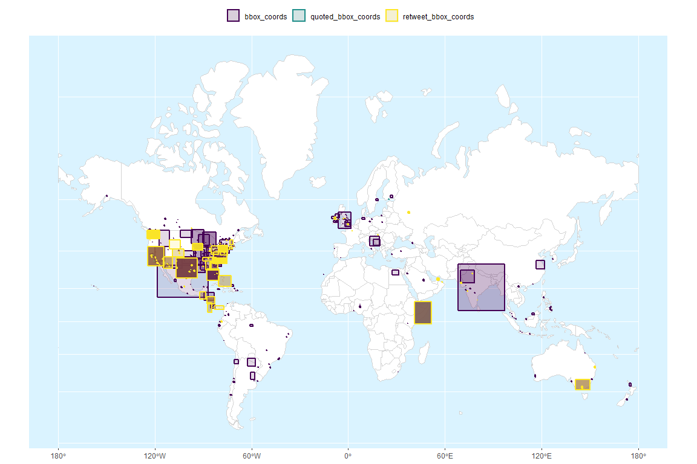

<!-- README.Rmd generates README.md. -->

# `{tweetio}`

<!-- badges: start -->

[](https://www.tidyverse.org/lifecycle/#experimental)
[](https://github.com/knapply/tweetio/commits/master)
[](https://codecov.io/gh/knapply/tweetio?branch=master)
[](https://ci.appveyor.com/project/knapply/tweetio)
[](https://travis-ci.org/knapply/tweetio)
[](https://www.gnu.org/licenses/gpl-3.0)
[](https://www.r-project.org/)
[](https://github.com/knapply/tweetio)
[](http://hits.dwyl.io/knapply/tweetio)
<!-- badges: end -->

# Progress

### Supported Data Inputs

  - [x] Twitter API streams: .json, .json.gz
  - [x] API to Elasticsearch data dump (JSON Array): .json, .json.gz
  - [x] API to Elasticsearch data dump (line-delimited JSON): .jsonl,
    .jsonl.gz

### Supported Data Outputs

  - [x] .graphml, currently available in
    [`{tweetgraph}`](https://knapply.github.io/tweetgraph/)
  - [ ] CSV (will likely be CSVY once `{data.table}`’s `fread(yaml =
    TRUE)` feature stabilizes)

### Extras

  - [x] Spatial Tweets via `tweetio::as_tweet_sf()`

# Introduction

**The [`{rtweet}`](https://rtweet.info/) package spoils R users
*rotten*… in the best possible way**. The behind-the-scenes data
carpentry is so seamless that the user doesn’t need to know anything
about the horrors of Twitter data, which is pretty amazing. If you use
`{rtweet}`, you owe Mike Kearney some serious gratitude/citations.

`{tweetio}` is **not** a competitor to `{rtweet}`, but it definitely
attempts to emulate its data frame schema because…

1.  It’s incredibly easy to use.
2.  It’s more efficient to analyze than a key-value format following the
    raw data.
3.  It’d be a waste not to maximize compatibiltiy with tools built
    specifically around `{rtweet}`’s data frames.

> ***You** bring the tweets, `{tweetio}` gets them into R.*

`{tweetio}` (mainly) focuses on one thing: **going from raw tweets to
`{rtweet}`-style data frames (or other useful structures) as quickly and
efficiently as possible**. Whether the data came from the Twitter API, a
database dump, or some other source, `{tweetio}`’s job is to get them
into R.

# Installation

You’ll need a C++ compiler. You can check if you’re ready to go by
running the following code:

``` r
# install.packages("pkgbuild")
pkgbuild::check_build_tools()
```

If you’re using Windows, you’ll need
[Rtools](https://cran.r-project.org/bin/windows/Rtools/).

You probably want to follow the page’s advice and select the recommended
version, which is currently Rtools35.exe. When you’re installing Rtools,
you need to make sure you check the box stating “Add rtools to system
PATH”.

I have needed to reboot every computer on which I’ve installed Rtools
before I could compile an R package.

Once you’re done, you can install `{tweetio}`.

``` r
# install.packages("remotes")
remotes::install_github("knapply/tweetio")
```

# Usage

## Simple Example

First, we’ll save a stream of tweets using `rtweet::stream_tweets()`.

``` r
temp_file <- tempfile(fileext = ".json")
rtweet::stream_tweets(timeout = 15, parse = FALSE, file_name = temp_file)
```

We can then pass the file path to `tweetio::read_tweets()` to
efficiently parse the data into an `{rtweet}`-style data frame.

``` r
library(tweetio)

small_rtweet_stream <- read_tweets(temp_file)
dplyr::glimpse(small_rtweet_stream)
```

    #> Observations: 561
    #> Variables: 73
    #> $ user_id                 <chr> "1588404090", "3187206246", "338056507...
    #> $ status_id               <chr> "1190817297335640064", "11908172973439...
    #> $ created_at              <dttm> 2019-11-03 02:25:42, 2019-11-03 02:25...
    #> $ screen_name             <chr> "lllllllllllllt1", "Szgmr_Ren_C_bot", ...
    #> $ text                    <chr> "139", "<U+53CD><U+6B63><U+4E0D><U+7BA1><U+600E><U+9EBC><U+8AAA><U+90FD><U+662F><U+4F60><U+8F38><U+4E86>", "@MiraCo_D <U+30DF><U+30E9><U+30B3><U+6C0F>...
    #> $ source                  <chr> "<a href=\"http://twittbot.net/\" rel=...
    #> $ reply_to_status_id      <chr> NA, NA, "1190814273695387648", NA, NA,...
    #> $ reply_to_user_id        <chr> NA, NA, "973172241138462721", NA, NA, ...
    #> $ reply_to_screen_name    <chr> NA, NA, "MiraCo_D", NA, NA, NA, NA, NA...
    #> $ is_quote                <lgl> FALSE, FALSE, FALSE, FALSE, FALSE, FAL...
    #> $ is_retweeted            <lgl> FALSE, FALSE, FALSE, FALSE, FALSE, FAL...
    #> $ hashtags                <list> [<>, <>, <>, <>, <>, <>, <>, <>, <>, ...
    #> $ urls_expanded_url       <list> [<>, <>, <>, <>, <>, <>, <>, <>, <>, ...
    #> $ media_expanded_url      <list> [<>, <>, <>, "https://twitter.com/Dek...
    #> $ media_url               <list> [<>, <>, <>, "http://pbs.twimg.com/me...
    #> $ media_type              <list> [<>, <>, <>, "photo", <>, <>, <>, <>,...
    #> $ mentions_user_id        <list> [<>, <>, "973172241138462721", "10724...
    #> $ mentions_screen_name    <list> [<>, <>, "MiraCo_D", "Dekopon_56", "M...
    #> $ lang                    <chr> "und", "zh", "ja", "ja", "in", "es", "...
    #> $ quoted_status_id        <chr> NA, NA, NA, NA, NA, NA, NA, NA, NA, NA...
    #> $ quoted_text             <chr> NA, NA, NA, NA, NA, NA, NA, NA, NA, NA...
    #> $ quoted_created_at       <dttm> NA, NA, NA, NA, NA, NA, NA, NA, NA, N...
    #> $ quoted_source           <chr> NA, NA, NA, NA, NA, NA, NA, NA, NA, NA...
    #> $ quoted_favorite_count   <int> NA, NA, NA, NA, NA, NA, NA, NA, NA, NA...
    #> $ quoted_retweet_count    <int> NA, NA, NA, NA, NA, NA, NA, NA, NA, NA...
    #> $ quoted_user_id          <chr> NA, NA, NA, NA, NA, NA, NA, NA, NA, NA...
    #> $ quoted_screen_name      <chr> NA, NA, NA, NA, NA, NA, NA, NA, NA, NA...
    #> $ quoted_name             <chr> NA, NA, NA, NA, NA, NA, NA, NA, NA, NA...
    #> $ quoted_followers_count  <int> NA, NA, NA, NA, NA, NA, NA, NA, NA, NA...
    #> $ quoted_friends_count    <int> NA, NA, NA, NA, NA, NA, NA, NA, NA, NA...
    #> $ quoted_statuses_count   <int> NA, NA, NA, NA, NA, NA, NA, NA, NA, NA...
    #> $ quoted_location         <chr> NA, NA, NA, NA, NA, NA, NA, NA, NA, NA...
    #> $ quoted_description      <chr> NA, NA, NA, NA, NA, NA, NA, NA, NA, NA...
    #> $ quoted_verified         <lgl> TRUE, TRUE, TRUE, TRUE, TRUE, TRUE, TR...
    #> $ retweet_status_id       <chr> NA, NA, NA, "1172297824727257089", NA,...
    #> $ retweet_text            <chr> NA, NA, NA, "<U+4FDD><U+80B2><U+58EB><U+5B9F><U+9332> <U+3067><U+3053><U+5148><U+751F>\n\n<U+7B2C>100<U+8A71> <U+53EF><U+611B><U+3044><U+3093><U+3060>...
    #> $ retweet_created_at      <dttm> NA, NA, NA, 2019-09-12 23:55:56, NA, ...
    #> $ retweet_source          <chr> NA, NA, NA, "<a href=\"http://twitter....
    #> $ retweet_favorite_count  <int> NA, NA, NA, 81037, NA, NA, 270, NA, NA...
    #> $ retweet_retweet_count   <int> NA, NA, NA, 14082, NA, NA, 296, NA, NA...
    #> $ retweet_user_id         <chr> NA, NA, NA, "1072433147478913025", NA,...
    #> $ retweet_screen_name     <chr> NA, NA, NA, "Dekopon_56", NA, NA, "Poi...
    #> $ retweet_name            <chr> NA, NA, NA, "<U+3067><U+3053><U+307D><U+3093><U+543E><U+90CE>@<U+300C><U+5B9F><U+9332> <U+4FDD><U+80B2><U+58EB><U+3067><U+3053><U+5148><U+751F><U+300D> <U+66F8><U+7C4D><U+8CA9><U+58F2><U+4E2D>...
    #> $ retweet_followers_count <int> NA, NA, NA, 260909, NA, NA, 4273, NA, ...
    #> $ retweet_friends_count   <int> NA, NA, NA, 260909, NA, NA, 4273, NA, ...
    #> $ retweet_statuses_count  <int> NA, NA, NA, 2659, NA, NA, 101268, NA, ...
    #> $ retweet_location        <chr> NA, NA, NA, NA, NA, NA, "S<U+5E02><U+675C><U+738B><U+753A>", NA, N...
    #> $ retweet_description     <chr> NA, NA, NA, "<U+7D75><U+3092><U+63CF><U+304F><U+3053><U+3068><U+3068><U+3001><U+6F2B><U+753B><U+3001><U+6B74><U+53F2><U+3001><U+6620><U+753B><U+304C><U+597D><U+304D><U+306A><U+3086><U+308B><U+3086><U+308B><U+4EBA>...
    #> $ retweet_verified        <lgl> TRUE, TRUE, TRUE, FALSE, TRUE, TRUE, F...
    #> $ place_url               <chr> NA, NA, NA, NA, NA, NA, NA, NA, NA, NA...
    #> $ place_name              <chr> NA, NA, NA, NA, NA, NA, NA, NA, NA, NA...
    #> $ place_full_name         <chr> NA, NA, NA, NA, NA, NA, NA, NA, NA, NA...
    #> $ place_type              <chr> NA, NA, NA, NA, NA, NA, NA, NA, NA, NA...
    #> $ country                 <chr> NA, NA, NA, NA, NA, NA, NA, NA, NA, NA...
    #> $ country_code            <chr> NA, NA, NA, NA, NA, NA, NA, NA, NA, NA...
    #> $ bbox_coords             <list> [<>, <>, <>, <>, <>, <>, <>, <>, <>, ...
    #> $ name                    <chr> "<U+3059><U+3067><U+308F><U+306E>", "<U+96C0><U+68EE><U+84EE>", "<U+30D1><U+30AA><U+30FC> 100%(<U+4FEE><U+884C><U+306E><U+8EAB>)\U0001f9...
    #> $ location                <chr> NA, "FooFighter<U+7E3D><U+90E8>", "<U+5343><U+8449><U+770C>", NA, "HIRING...
    #> $ description             <chr> "<U+270C>('<U+03C9>'<U+270C> )<U+4E09><U+270C>('<U+03C9>')<U+270C><U+4E09>( <U+270C>'<U+03C9>')<U+270C><U+697D><U+3057><U+3044>!!", "<U+300C><U+5361><U+7247>...
    #> $ url                     <chr> "http://maimai.sega.jp/index.shtml", N...
    #> $ protected               <lgl> FALSE, FALSE, FALSE, FALSE, FALSE, FAL...
    #> $ followers_count         <int> 4, 1004, 269, 1199, 18112, 204, 180, 0...
    #> $ friends_count           <int> 2, 927, 283, 1538, 1564, 205, 368, 66,...
    #> $ listed_count            <int> 0, 1, 8, 67, 803, 0, 10, 0, 0, 10, 0, ...
    #> $ statuses_count          <int> 603972, 35459, 12316, 314537, 68178, 2...
    #> $ favourites_count        <int> 0, 1, 25470, 13883, 669, 7042, 91836, ...
    #> $ account_created_at      <dttm> 2013-07-12 12:55:42, 2015-05-07 03:44...
    #> $ verified                <lgl> FALSE, FALSE, FALSE, FALSE, FALSE, FAL...
    #> $ account_lang            <chr> NA, NA, NA, NA, NA, NA, NA, NA, NA, NA...
    #> $ profile_banner_url      <chr> "https://pbs.twimg.com/profile_banners...
    #> $ profile_image_url       <chr> "http://pbs.twimg.com/profile_images/3...
    #> $ timestamp_ms            <dttm> 2019-11-03 02:25:42, 2019-11-03 02:25...
    #> $ contributors_enabled    <lgl> TRUE, TRUE, TRUE, TRUE, TRUE, TRUE, TR...

## Scaling Up

We’re more interested in handling much larger data sets, like this one
that was also obtained using `rtweet::stream_tweets()`. The file has
been compressed to an 18 Mb .gz file (153 Mb uncompressed).

Currently, `{rtweet}` may fail parsing streams because the data returned
may not be valid JSON.

``` r
rtweet_stream_path <- "inst/example-data/api-stream.json.gz"

rtweet::parse_stream(rtweet_stream_path)
```

    #> Error: parse error: after array element, I expect ',' or ']'
    #>           736405012481"},"timestamp_ms":"1569693801061"}}{"created_at"
    #>                      (right here) ------^

This is unfortunate because I originally wanted to compare benchmarks
since `{tweetio}` can handle these situations.

``` r
big_rtweet_stream <- read_tweets(rtweet_stream_path)
```

How long does that take?

``` r
library(microbenchmark)

big_rtweet_time <- microbenchmark(
  read_tweets(rtweet_stream_path),
  times = 3
)

big_rtweet_time
```

    #> Unit: seconds
    #>                             expr      min       lq     mean   median
    #>  read_tweets(rtweet_stream_path) 2.734777 2.989928 3.139715 3.245078
    #>        uq     max neval
    #>  3.342184 3.43929     3

## Data Dumps

Using Elasticsearch seems to be the most common practice for handling
social media data at scale, but it’s (unfortunately) possible that
you’ll need to work with data dumps.

The data collected from APIs are stored inside a nested JSON object
named `"doc"`. `"doc"` is typically embedded in a ton of system
metadata, most of which you probably don’t care about.

I’ve encountered two flavors of these schema:

1.  .jsonl: line-delimited JSON (which is nearly the same as NDJSON).
2.  .json: the complete contents of an Elasticsearch index, which is a
    JSON array.

The .jsonl structure looks something like this:

``` json
{"system_metadata_you_dont_care_about":"blahblahblah","more_metadata1":"blahblahblah","more_metadata2":"blahblahblah","more_metadata3":"blahblahblah","more_metadata4":"blahblahblah","more_metadata5":"blahblahblah","doc":{"text":"********************HERE'S THE DATA YOU ACTUALLY WANT********************","id":92108498098018010401,"id_str":"92108498098018010401"},"more_metadata6":"blahblahblah","more_metadata7":"blahblahblah","more_metadata8":"blahblahblah","more_metadata9":"blahblahblah","more_metadata10":"blahblahblah"}
{"system_metadata_you_dont_care_about":"blahblahblah","more_metadata1":"blahblahblah","more_metadata2":"blahblahblah","more_metadata3":"blahblahblah","more_metadata4":"blahblahblah","more_metadata5":"blahblahblah","doc":{"text":"********************HERE'S THE DATA YOU ACTUALLY WANT********************","id":92108498098018010401,"id_str":"92108498098018010401"},"more_metadata6":"blahblahblah","more_metadata7":"blahblahblah","more_metadata8":"blahblahblah","more_metadata9":"blahblahblah","more_metadata10":"blahblahblah"}
{"system_metadata_you_dont_care_about":"blahblahblah","more_metadata1":"blahblahblah","more_metadata2":"blahblahblah","more_metadata3":"blahblahblah","more_metadata4":"blahblahblah","more_metadata5":"blahblahblah","doc":{"text":"********************HERE'S THE DATA YOU ACTUALLY WANT********************","id":92108498098018010401,"id_str":"92108498098018010401"},"more_metadata6":"blahblahblah","more_metadata7":"blahblahblah","more_metadata8":"blahblahblah","more_metadata9":"blahblahblah","more_metadata10":"blahblahblah"}
```

Each line contains a single JSON object resembling the following:

``` json
{
    "system_metadata_you_dont_care_about": "blahblahblah",
    "more_metadata1": "blahblahblah",
    "more_metadata2": "blahblahblah",
    "more_metadata3": "blahblahblah",
    "more_metadata4": "blahblahblah",
    "more_metadata5": "blahblahblah",
    "doc": {
        "text": "********************HERE'S THE DATA YOU ACTUALLY WANT********************",
        "id": 92108498098018010401,
        "id_str": "92108498098018010401"
    },
    "more_metadata6": "blahblahblah",
    "more_metadata7": "blahblahblah",
    "more_metadata8": "blahblahblah",
    "more_metadata9": "blahblahblah",
    "more_metadata10": "blahblahblah"
}
```

And the .json structure looks something like this:

``` json
[
    {
        "_id": "e5daf1467d2438e31b11b44a82cbd7f5758ba5a1f1d3ecbcc6e1fc04dc9c7c4d-3016858092318",
        "_index": "org-77f135f331153568ab7eb0e4c24623a7-default-3769a33b9e88598e38317591e2ee31c3-default-030009",
        "_score": null,
        "_source": {
            "system_metadata_you_dont_care_about": "blahblahblah",
            "more_metadata1": "blahblahblah",
            "doc": {
                "text": "********************HERE'S THE DATA YOU ACTUALLY WANT********************",
                "id": 92108498098018010401,
                "id_str": "92108498098018010401"
            },
            "more_metadata6": "blahblahblah"
        }
    },
    {
        "_id": "e5daf1467d2438e31b11b44a82cbd7f5758ba5a1f1d3ecbcc6e1fc04dc9c7c4d-3016858092318",
        "_index": "org-77f135f331153568ab7eb0e4c24623a7-default-3769a33b9e88598e38317591e2ee31c3-default-030009",
        "_score": null,
        "_source": {
            "system_metadata_you_dont_care_about": "blahblahblah",
            "more_metadata1": "blahblahblah",
            "doc": {
                "text": "********************HERE'S THE DATA YOU ACTUALLY WANT********************",
                "id": 92108498098018010401,
                "id_str": "92108498098018010401"
            },
            "more_metadata6": "blahblahblah"
        }
    }
]
```

This has three unfortunate consequences:

1.  Packages that were purpose-built to work directly with `{rtweet}`’s
    data frames can’t play along with your data.
2.  You’re going to waste most of your time (and memory) getting data
    into R that you’re not going to use.
3.  The data are *very* tedious to restructure in R (lists of lists of
    lists of lists of lists…).

`{tweetio}` solves this by parsing everything at the C++ level, but only
returning the actual tweet data to R.

Here’s a benchmark for reading a 890 Mb JSON array data dump.

``` r
res <- microbenchmark(

  read_tweets(data_dump) # *****************************************************
  
  , times = 3
)

res
```

    #> Unit: seconds
    #>                    expr      min       lq     mean   median       uq
    #>  read_tweets(data_dump) 4.204468 4.418793 4.533511 4.633118 4.698032
    #>       max neval
    #>  4.762947     3

# Spatial Tweets

Tweet JSON contains an object called `"place"` that is set aside for
location information. If present, it looks something like the following.

``` json
{
    "text": "#rstats4lyfe",
    "place": {
      "id": "00d546b224a6764d",
      "url": "https://api.twitter.com/1.1/geo/id/blahblah.json",
      "place_type": "city",
      "name": "General Pico",
      "full_name": "General Pico, Argentina",
      "country_code": "AR",
      "country": "Argentina",
      "bounding_box": {
          "type": "Polygon",
          "coordinates": [
              [
                  [
                      -63.784544,
                      -35.689402
                  ],
                  [
                      -63.784544,
                      -35.641737
                  ],
                  [
                      -63.724717,
                      -35.641737
                  ],
                  [
                      -63.724717,
                      -35.689402
                  ]
              ]
          ]
      },
      "attributes": {}
    }
}
```

In `{rtweet}`-style data frames, this corresponds to the `bbox_coords`
column.

If you have `{sf}` installed, you can use `as_tweet_sf()` to filter the
tweets for those that contain valid coordinates and build their bounding
box polygons.

``` r
tweet_sf <- as_tweet_sf(big_rtweet_stream) 

tweet_sf[, "geometry"]
```

    #> Simple feature collection with 321 features and 0 fields
    #> geometry type:  POLYGON
    #> dimension:      XY
    #> bbox:           xmin: -157.9505 ymin: -55.11686 xmax: 139.7527 ymax: 56.50253
    #> epsg (SRID):    4326
    #> proj4string:    +proj=longlat +datum=WGS84 +no_defs
    #> First 10 features:
    #>                          geometry
    #> 1  POLYGON ((-97.51982 35.1532...
    #> 2  POLYGON ((8.665852 44.37908...
    #> 3  POLYGON ((-106.9506 31.1206...
    #> 4  POLYGON ((-63.39386 -41.035...
    #> 5  POLYGON ((30.42998 39.76794...
    #> 6  POLYGON ((-118.6684 33.7045...
    #> 7  POLYGON ((139.136 36.24259,...
    #> 8  POLYGON ((135.5633 34.68448...
    #> 9  POLYGON ((-119.0618 34.1268...
    #> 10 POLYGON ((-63.78454 -35.689...

From there, you can easily manipulate the data like any other `{sf}`
object.

``` r
library(leaflet)

tweet_sf %>% 
  leaflet() %>% 
  addTiles() %>% 
  addPolygons()
```



Note that `NULL` is returned in the event you don’t have any valid
coordinates…

``` r
as_tweet_sf(big_rtweet_stream[1,])
```

    #> NULL

… which maximizes flexibility in binding rows…

``` r
sf_list <- lapply(
  list(1, 2:100, 101:200, 201:300, 301:1000, nrow(big_rtweet_stream)),
  function(.x) as_tweet_sf(big_rtweet_stream[.x])
)

lapply(sf_list, `[`, "geometry")
```

    #> [[1]]
    #> NULL
    #> 
    #> [[2]]
    #> Simple feature collection with 1 feature and 0 fields
    #> geometry type:  POLYGON
    #> dimension:      XY
    #> bbox:           xmin: -97.51982 ymin: 35.15327 xmax: -97.37053 ymax: 35.29133
    #> epsg (SRID):    4326
    #> proj4string:    +proj=longlat +datum=WGS84 +no_defs
    #>                         geometry
    #> 1 POLYGON ((-97.51982 35.1532...
    #> 
    #> [[3]]
    #> Simple feature collection with 3 features and 0 fields
    #> geometry type:  POLYGON
    #> dimension:      XY
    #> bbox:           xmin: -106.9506 ymin: -41.03501 xmax: 9.095838 ymax: 44.51992
    #> epsg (SRID):    4326
    #> proj4string:    +proj=longlat +datum=WGS84 +no_defs
    #>                         geometry
    #> 1 POLYGON ((8.665852 44.37908...
    #> 2 POLYGON ((-106.9506 31.1206...
    #> 3 POLYGON ((-63.39386 -41.035...
    #> 
    #> [[4]]
    #> NULL
    #> 
    #> [[5]]
    #> Simple feature collection with 11 features and 0 fields
    #> geometry type:  POLYGON
    #> dimension:      XY
    #> bbox:           xmin: -119.0618 ymin: -55.11686 xmax: 139.2828 ymax: 48.90215
    #> epsg (SRID):    4326
    #> proj4string:    +proj=longlat +datum=WGS84 +no_defs
    #> First 10 features:
    #>                          geometry
    #> 1  POLYGON ((30.42998 39.76794...
    #> 2  POLYGON ((-118.6684 33.7045...
    #> 3  POLYGON ((139.136 36.24259,...
    #> 4  POLYGON ((135.5633 34.68448...
    #> 5  POLYGON ((-119.0618 34.1268...
    #> 6  POLYGON ((-63.78454 -35.689...
    #> 7  POLYGON ((2.224101 48.81552...
    #> 8  POLYGON ((135.5001 34.66076...
    #> 9  POLYGON ((-117.2825 32.5396...
    #> 10 POLYGON ((20.01429 41.85184...
    #> 
    #> [[6]]
    #> NULL

``` r
do.call(rbind, sf_list)[, "geometry"]
```

    #> Simple feature collection with 15 features and 0 fields
    #> geometry type:  POLYGON
    #> dimension:      XY
    #> bbox:           xmin: -119.0618 ymin: -55.11686 xmax: 139.2828 ymax: 48.90215
    #> epsg (SRID):    4326
    #> proj4string:    +proj=longlat +datum=WGS84 +no_defs
    #> First 10 features:
    #>                          geometry
    #> 1  POLYGON ((-97.51982 35.1532...
    #> 2  POLYGON ((8.665852 44.37908...
    #> 3  POLYGON ((-106.9506 31.1206...
    #> 4  POLYGON ((-63.39386 -41.035...
    #> 5  POLYGON ((30.42998 39.76794...
    #> 6  POLYGON ((-118.6684 33.7045...
    #> 7  POLYGON ((139.136 36.24259,...
    #> 8  POLYGON ((135.5633 34.68448...
    #> 9  POLYGON ((-119.0618 34.1268...
    #> 10 POLYGON ((-63.78454 -35.689...

# How can we go faster?

Until Rtools 4.0 hits (or the
[`simdjson`](https://github.com/lemire/simdjson) library decides to
[relax its C++17
requirement](https://github.com/lemire/simdjson/issues/307)), I’m not
sure how we can go much faster while maintaining cross-platform
compatibility. That said, if C++ is your mother tongue (and you see room
for optimization), please don’t hesitate to contribute.

# Acknowledgements

`{tweetio}` uses a combination of C++ via
[`{Rcpp}`](http://www.rcpp.org/), the
[`rapidjson`](http://rapidjson.org/) C++ library (made available by
[`{rapidjsonr}`](https://cran.r-project.org/web/packages/rapidjsonr/index.html)),
and **R’s secret weapon**:
[`{data.table}`](https://rdatatable.gitlab.io/data.table/).

Major inspiration from [{`ndjson`}](https://gitlab.com/hrbrmstr/ndjson)
was taken, including its use of
[`Gzstream`](https://www.cs.unc.edu/Research/compgeom/gzstream/).
