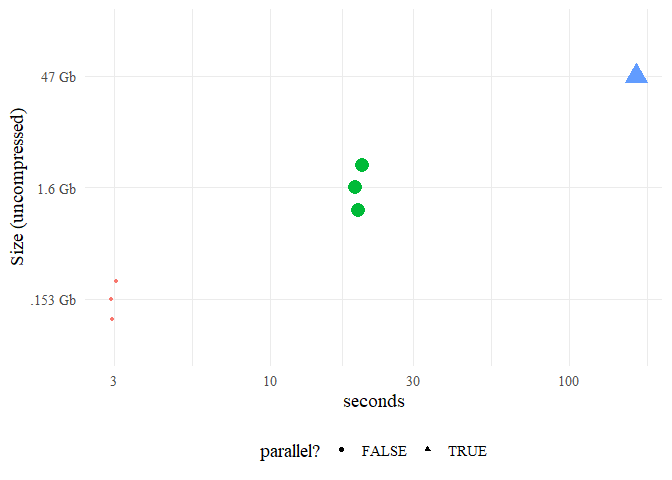

<!-- README.Rmd generates README.md. -->

# `{tweetio}`

<!-- badges: start -->

[](https://www.tidyverse.org/lifecycle/#experimental)
[](https://github.com/knapply/tweetio/commits/master)
[](https://codecov.io/gh/knapply/tweetio?branch=master)
[](https://ci.appveyor.com/project/knapply/tweetio)
[](https://travis-ci.org/knapply/tweetio)
[](https://www.gnu.org/licenses/gpl-3.0)
[](https://www.r-project.org/)
[](https://github.com/knapply/tweetio)
[](http://hits.dwyl.io/knapply/tweetio)
<!-- badges: end -->

# Introduction

**The [`{rtweet}`](https://rtweet.info/) package spoils R users
*rotten*… in the best possible way**. The behind-the-scenes data
carpentry is so seamless that the user doesn’t need to know anything
about the horrors of Twitter data, which is pretty amazing. If you use
`{rtweet}`, you owe Mike Kearney some serious gratitude/citations.

`{tweetio}` is **not** a competitor to `{rtweet}`, but it definitely
attempts to emulate its data frame schema because…

1.  It’s incredibly easy to use.
2.  It’s more efficient to analyze than a key-value format following the
    raw data.
3.  It’d be a waste not to maximize compatibiltiy with tools built
    specifically around `{rtweet}`’s data frames.

> ***You** bring the data, `{tweetio}` gets them into R.*

`{tweetio}` focuses on one thing: **going from raw tweets to
`{rtweet}`-style data frames (or other useful structures) as quickly and
efficiently as possible**. Whether the data came from the Twitter API, a
vendor, or some other source, `{tweetio}`’s job is to get them into R.

## Installation

You’ll need a C++ compiler. If you’re using Windows, that means
[Rtools](https://cran.r-project.org/bin/windows/Rtools/).

``` r
# install.packages("remotes")
remotes::install_github("knapply/tweetio")
```

## Supported Data Inputs

  - [x] Twitter API streams: .json, .json.gz
  - [x] API to Elasticsearch data dump (JSON Array): .json, .json.gz
  - [x] API to Elasticsearch data dump (line-delimited JSON): .jsonl,
    .jsonl.gz

## Supported Data Outputs

  - [ ] CSV
  - [ ] .graphml via
    [`{tweetgraph}`](https://knapply.github.io/tweetgraph/) integration

## Usage

### Simple Example

First, we’ll save a stream of tweets using `rtweet::stream_tweets()`.

``` r
temp_file <- tempfile(fileext = ".json")
rtweet::stream_tweets(timeout = 15, parse = FALSE, file_name = temp_file)
```

We can then pass the file path to `tweetio::read_tweets()` to
efficiently parse the data into an `{rtweet}`-style data frame.

``` r
library(tweetio)

small_rtweet_stream <- read_tweets(temp_file)
dplyr::glimpse(small_rtweet_stream)
```

    #> Rows: 362
    #> Columns: 71
    #> $ user_id                 <chr> "594234016", "1138555968273489920", "1...
    #> $ status_id               <chr> "1179209099667529728", "11792090996549...
    #> $ created_at              <chr> "Wed Oct 02 01:38:52 +0000 2019", "Wed...
    #> $ screen_name             <chr> "jim_tellez", "ViniciusdeJesu7", "Gett...
    #> $ text                    <chr> "RT @NBCSBulls: For all the kids out t...
    #> $ source                  <chr> "<a href=\"http://twitter.com/download...
    #> $ reply_to_status_id      <chr> NA, NA, NA, NA, NA, NA, NA, NA, NA, "1...
    #> $ reply_to_user_id        <chr> NA, NA, NA, NA, NA, NA, NA, NA, NA, "1...
    #> $ reply_to_screen_name    <chr> NA, NA, NA, NA, NA, NA, NA, NA, NA, "s...
    #> $ is_quote                <lgl> FALSE, FALSE, FALSE, FALSE, FALSE, FAL...
    #> $ is_retweeted            <lgl> FALSE, FALSE, FALSE, FALSE, FALSE, FAL...
    #> $ hashtags                <list> [<>, <>, <>, <>, <>, "HBDMingEr4Saint...
    #> $ urls_expanded_url       <list> [<>, <>, <>, <>, <>, <>, <>, <>, <>, ...
    #> $ media_expanded_url      <list> [<>, "https://twitter.com/ViniciusdeJ...
    #> $ mentions_user_id        <list> ["423540866", <>, "105491374377405235...
    #> $ mentions_screen_name    <list> ["NBCSBulls", <>, "hozuki_app", <>, "...
    #> $ lang                    <chr> "en", "pt", "ja", "es", "und", "th", "...
    #> $ quoted_status_id        <chr> NA, NA, NA, NA, NA, NA, NA, NA, NA, NA...
    #> $ quoted_text             <chr> NA, NA, NA, NA, NA, NA, NA, NA, NA, NA...
    #> $ quoted_created_at       <chr> NA, NA, NA, NA, NA, NA, NA, NA, NA, NA...
    #> $ quoted_source           <chr> NA, NA, NA, NA, NA, NA, NA, NA, NA, NA...
    #> $ quoted_favorite_count   <int> NA, NA, NA, NA, NA, NA, NA, NA, NA, NA...
    #> $ quoted_retweet_count    <int> NA, NA, NA, NA, NA, NA, NA, NA, NA, NA...
    #> $ quoted_user_id          <chr> NA, NA, NA, NA, NA, NA, NA, NA, NA, NA...
    #> $ quoted_screen_name      <chr> NA, NA, NA, NA, NA, NA, NA, NA, NA, NA...
    #> $ quoted_name             <chr> NA, NA, NA, NA, NA, NA, NA, NA, NA, NA...
    #> $ quoted_followers_count  <int> NA, NA, NA, NA, NA, NA, NA, NA, NA, NA...
    #> $ quoted_friends_count    <int> NA, NA, NA, NA, NA, NA, NA, NA, NA, NA...
    #> $ quoted_statuses_count   <int> NA, NA, NA, NA, NA, NA, NA, NA, NA, NA...
    #> $ quoted_location         <chr> NA, NA, NA, NA, NA, NA, NA, NA, NA, NA...
    #> $ quoted_description      <chr> NA, NA, NA, NA, NA, NA, NA, NA, NA, NA...
    #> $ quoted_verified         <lgl> TRUE, TRUE, TRUE, TRUE, TRUE, TRUE, TR...
    #> $ retweet_status_id       <chr> "1179184219416858624", NA, "1178582869...
    #> $ retweet_text            <chr> "For all the kids out there, come meet...
    #> $ retweet_created_at      <chr> "Wed Oct 02 00:00:00 +0000 2019", NA, ...
    #> $ retweet_source          <chr> "<a href=\"https://about.twitter.com/p...
    #> $ retweet_favorite_count  <int> 57, NA, 1358, NA, 1, 3, NA, NA, NA, NA...
    #> $ retweet_retweet_count   <int> 11, NA, 334, NA, 1, 5, NA, NA, NA, NA,...
    #> $ retweet_user_id         <chr> "423540866", NA, "1054913743774052352"...
    #> $ retweet_screen_name     <chr> "NBCSBulls", NA, "hozuki_app", NA, "An...
    #> $ retweet_name            <chr> "Bulls Talk", NA, "<U+30A2><U+30D7><U+30EA><U+300E><U+9B3C><U+706F><U+306E><U+51B7><U+5FB9>~<U+5730><U+7344><U+306E><U+30D1><U+30BA><U+30EB><U+3082><U+541B><U+6B21>...
    #> $ retweet_followers_count <int> 22596, NA, 42949, NA, 118, 291, NA, NA...
    #> $ retweet_friends_count   <int> 22596, NA, 42949, NA, 118, 291, NA, NA...
    #> $ retweet_statuses_count  <int> 25505, NA, 314, NA, 2565, 7298, NA, NA...
    #> $ retweet_location        <chr> NA, NA, NA, NA, NA, NA, NA, NA, NA, NA...
    #> $ retweet_description     <chr> "Home for all 82 Bulls games", NA, "<U+30A2><U+30D7>...
    #> $ retweet_verified        <lgl> TRUE, TRUE, FALSE, TRUE, FALSE, FALSE,...
    #> $ place_url               <chr> NA, NA, NA, NA, NA, NA, NA, NA, NA, NA...
    #> $ place_name              <chr> NA, NA, NA, NA, NA, NA, NA, NA, NA, NA...
    #> $ place_full_name         <chr> NA, NA, NA, NA, NA, NA, NA, NA, NA, NA...
    #> $ place_type              <chr> NA, NA, NA, NA, NA, NA, NA, NA, NA, NA...
    #> $ country                 <chr> NA, NA, NA, NA, NA, NA, NA, NA, NA, NA...
    #> $ country_code            <chr> NA, NA, NA, NA, NA, NA, NA, NA, NA, NA...
    #> $ bbox_coords             <list> [<>, <>, <>, <>, <>, <>, <>, <>, <>, ...
    #> $ name                    <chr> "Jim Téllez", "Vinicius de Jesus", "H*...
    #> $ location                <chr> "CIUDAD DE CAGADAS ", NA, NA, NA, NA, ...
    #> $ description             <chr> "GOATFuckers INC. 666 \U0001f918\U0001...
    #> $ url                     <chr> NA, NA, NA, "https://instagram.com/mir...
    #> $ protected               <lgl> FALSE, FALSE, FALSE, FALSE, FALSE, FAL...
    #> $ followers_count         <int> 161, 0, 1, 245, 160, 57, 1008, 125, 12...
    #> $ friends_count           <int> 98, 12, 6, 280, 58, 84, 1408, 668, 129...
    #> $ listed_count            <int> 6, 0, 0, 1, 2, 0, 65, 9, 1, 3, 12, 16,...
    #> $ statuses_count          <int> 17430, 5, 133, 28109, 57983, 1285, 409...
    #> $ favourites_count        <int> 385, 5, 265, 9153, 52200, 930, 520, 23...
    #> $ account_created_at      <chr> "Wed May 30 02:38:00 +0000 2012", "Tue...
    #> $ verified                <lgl> FALSE, FALSE, FALSE, FALSE, FALSE, FAL...
    #> $ account_lang            <chr> NA, NA, NA, NA, NA, NA, NA, NA, NA, NA...
    #> $ profile_banner_url      <chr> "https://pbs.twimg.com/profile_banners...
    #> $ profile_image_url       <chr> "http://pbs.twimg.com/profile_images/1...
    #> $ timestamp_ms            <chr> "1569980332663", "1569980332660", "156...
    #> $ contributors_enabled    <lgl> TRUE, TRUE, TRUE, TRUE, TRUE, TRUE, TR...

### Scaling Up

In reality, we’re more interested in handling larger data sets. Here’s a
larger file obtained using `rtweet::stream_tweets()` that has been
compressed to an 18 Mb .gz file (153 Mb uncompressed).

``` r
big_rtweet_stream <- read_tweets("inst/example-data/api-stream.json.gz")
nrow(big_rtweet_stream)
```

    #> [1] 22760

How long does that take?

``` r
big_rtweet_time <- microbenchmark::microbenchmark(
  ".153" = read_tweets("inst/example-data/api-stream.json.gz"),
  times = 3
)
big_rtweet_time
```

    #> Unit: seconds
    #>  expr      min       lq     mean   median       uq      max neval
    #>  .153 2.091286 2.153652 2.207426 2.216018 2.265496 2.314974     3

### Vendor Data

Vendors seem to love storing social media data in Elasticsearch
databases, meaning that the data collected from APIs is stored inside a
nested JSON object named `"doc"`. `"doc"` is typically embedded in a ton
of system metadata, most of which you probably don’t care about.

This has three unfortunate consequences:

1.  Packages that were purpose-built to work directly with the Twitter
    API aren’t going to play along with your data.
2.  You’re going to waste most of your time (and memory) getting data
    into R that you’re not going to use.
3.  The data are *very* tedious to restructure in R (lists of lists of
    lists of lists of lists…).

`{tweetio}` solves this by parsing everything at the C++ level, but only
returning the actual tweet data to R.

``` r
single_vendor_parsed <- read_tweets(single_vendor_file)
nrow(single_vendor_parsed)
```

    #> [1] 94139

How long does that take?

``` r
single_vendor_time <- microbenchmark::microbenchmark(
  "1.6" = read_tweets(single_vendor_file),
  times = 3
)
single_vendor_time
```

    #> Unit: seconds
    #>  expr      min      lq     mean   median       uq      max neval
    #>   1.6 18.14802 18.2819 18.34454 18.41577 18.44281 18.46984     3

### Bulk Processing

While maybe not “big” data, handling millions of lines of JSON spread
across dozens of files in R isn’t exactly a picnic. To handle this
situation, the current implementation uses
`future.apply::future_lapply()` (if available) to process each file in
parallel before collapsing the resulting data frames via
`data.table::rbindlist()`.

`all_vendor_files` consists of 6 Gb (47 Gb uncompressed) spread across
30 files, which we can still process using `tweetio::read_tweets()`.

``` r
bulk_parsed <- read_tweets_bulk(all_vendor_files)
dim(bulk_parsed)
```

    #> [1] 2626381      71

How long does that take?

``` r
bulk_time <- microbenchmark::microbenchmark(
  "47" = read_tweets_bulk(all_vendor_files),
  times = 1
)
bulk_time
```

    #> Unit: seconds
    #>  expr     min      lq    mean  median      uq     max neval
    #>    47 126.458 126.458 126.458 126.458 126.458 126.458     1

## Benchmarks

``` r
res <- do.call(rbind, list(big_rtweet_time, single_vendor_time, bulk_time))

library(dplyr)
library(ggplot2)

res %>%
  mutate(file_size = paste(expr, "Gb"),
         time = time / 1e+09,
         `parallel?` = expr == "47") %>%
  ggplot(aes(x = file_size, y = time,
             color = file_size, size = as.numeric(expr), shape = `parallel?`)) +
  ggbeeswarm::geom_quasirandom() +
  guides(color = FALSE, size = FALSE) +
  labs(x = "Size (uncompressed)", y = "seconds") +
  coord_flip() +
  theme_minimal(base_size = 14, base_family = "serif") +
  theme(legend.position = "bottom")
```



Until Rtools 4.0 hits (or the
[`simdjson`](https://github.com/lemire/simdjson) library decides to
[relax its C++17
requirement](https://github.com/lemire/simdjson/issues/307)), I’m not
sure how we can go much faster while maintaining cross-platform
compatibility. That said, if C++ is your mother tongue (and you see room
for optimization), please don’t hesitate to contribute.

## Acknowledgements

`{tweetio}` uses a combination of C++ via
[`{Rcpp}`](http://www.rcpp.org/), the
[`rapidjson`](http://rapidjson.org/) C++ library (made available by
[`{rapidjsonr}`](https://cran.r-project.org/web/packages/rapidjsonr/index.html)),
and **R’s secret weapon**:
[`{data.table}`](https://rdatatable.gitlab.io/data.table/).

Major inspiration from [{`ndjson`}](https://gitlab.com/hrbrmstr/ndjson)
was taken, including its use of
[`Gzstream`](https://www.cs.unc.edu/Research/compgeom/gzstream/).

Parallel processing of multiple files is (currently) handled by
[`{future}`](https://cran.r-project.org/web/packages/future/index.html)
and
\[`{future.apply}`\]((<https://cran.r-project.org/web/packages/future.apply/index.html>),
if available.
