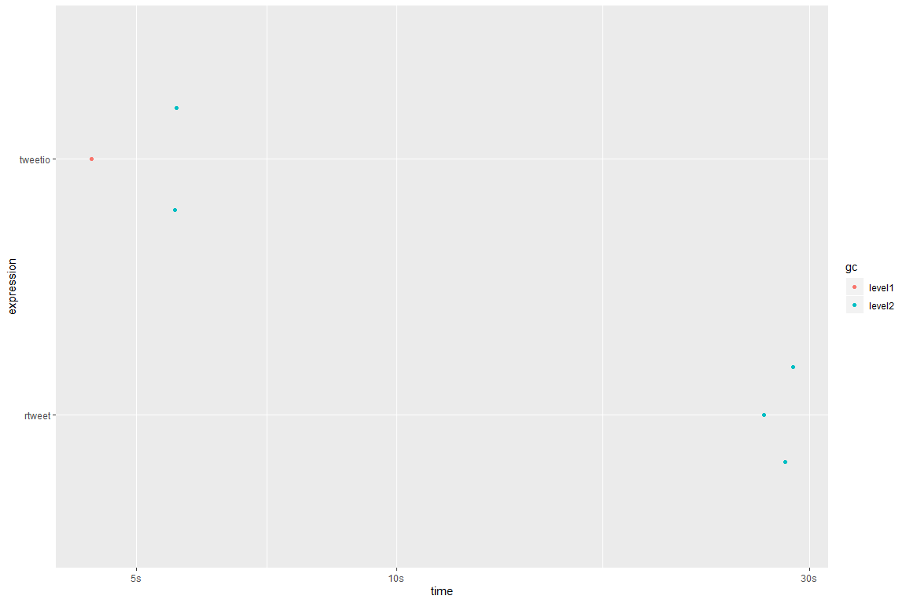
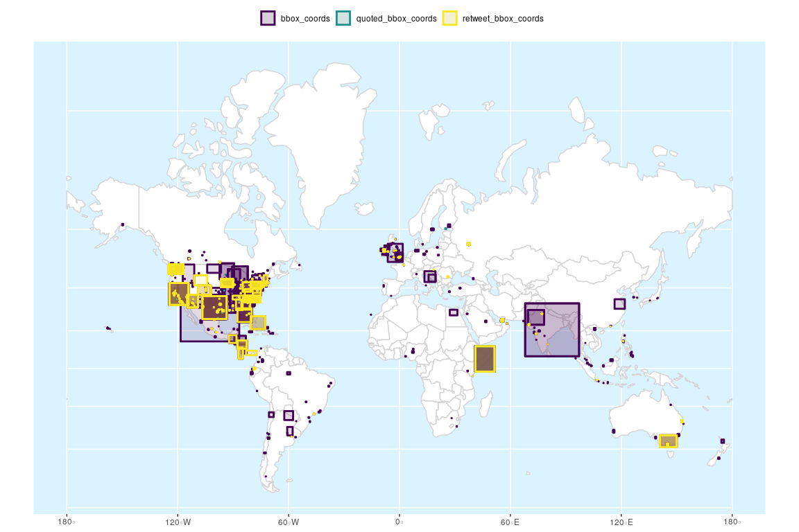

<!-- README.Rmd generates README.md. -->

# `{tweetio}`

<!-- badges: start -->

[](https://cran.r-project.org/package=tweetio)
[](https://www.tidyverse.org/lifecycle/#experimental)
[](https://github.com/knapply/tweetio/commits/master)
[](https://codecov.io/gh/knapply/tweetio?branch=master)
[](https://ci.appveyor.com/project/knapply/tweetio)
[](https://travis-ci.org/knapply/tweetio)
[](https://www.gnu.org/licenses/gpl-3.0)
[](https://www.r-project.org/)
[](https://github.com/knapply/tweetio)
[](http://hits.dwyl.io/knapply/tweetio)
<!-- badges: end -->

# Progress

### Supported Data Inputs

  - [x] Twitter API streams: .json, .json.gz
  - [x] API to Elasticsearch data dump (JSON Array): .json, .json.gz
  - [x] API to Elasticsearch data dump (line-delimited JSON): .jsonl,
    .jsonl.gz
  - [x] CSV (if written via `tweetio::write_tweet_csv()`)

### Supported Data Outputs

  - [x] CSV
  - [x] Excel
  - [ ] .graphml (currently available in
    [`{tweetgraph}`](https://knapply.github.io/tweetgraph/))

### Extras

  - [x] Spatial Tweets via `tweetio::as_tweet_sf()`

# Introduction

`{tweetio}` (mainly) focuses on one thing: **going from raw tweets to
`{rtweet}`-style data frames and other useful structures) as quickly as
possible**. Whether the data came from the Twitter API, a database dump,
or some other source, `{tweetio}`’s job is to get them into R.

`{tweetio}` is **not** a competitor to `{rtweet}`; it is not interested
in collecting Twitter data. That said, it definitely attempts to emulate
its data frame schema because…

1.  It’s incredibly easy to use.
2.  It’s more efficient to analyze than a key-value format following the
    raw data.
3.  It’d be a waste not to maximize compatibiltiy with tools built
    specifically around `{rtweet}`’s data frames.

# Installation

You’ll need a C++ compiler. If you’re using Windows, you’ll need
[Rtools](https://cran.r-project.org/bin/windows/Rtools/).

You probably want to follow the page’s advice and select the recommended
version, which is currently Rtools35.exe. When you’re installing Rtools,
you need to make sure you check the box stating “Add rtools to system
PATH” and reboot when you’re finished.

Once you’re done, reboot. Then you can install `{tweetio}`.

``` r
# install.packages("remotes")
remotes::install_github("knapply/tweetio")
```

# Usage

## Simple Example

First, we’ll save a stream of tweets using `rtweet::stream_tweets()`.

``` r
temp_file <- tempfile(fileext = ".json")
rtweet::stream_tweets(timeout = 15, parse = FALSE, file_name = temp_file)
```

We can then pass the file path to `tweetio::read_tweets()` to
efficiently parse the data into an `{rtweet}`-style data frame.

``` r
library(tweetio)

small_rtweet_stream <- read_tweets(temp_file)

tibble::as_tibble(small_rtweet_stream)
```

    #> # A tibble: 523 x 90
    #>    user_id status_id created_at          screen_name text  source reply_to_status~ reply_to_user_id
    #>    <chr>   <chr>     <dttm>              <chr>       <chr> <chr>  <chr>            <chr>           
    #>  1 101952~ 11962668~ 2019-11-18 03:20:16 pontaro051~ <U+5360><U+3044><U+3068><U+304B>~ Twitt~ <NA>             <NA>            
    #>  2 116264~ 11962668~ 2019-11-18 03:20:16 002Marine   "<U+522B><U+6765><U+79C1>~ Twitt~ <NA>             <NA>            
    #>  3 252134~ 11962668~ 2019-11-18 03:20:16 yann_poke1~ @kag~ Twitt~ 119626250587972~ 950213158878064~
    #>  4 108147~ 11962668~ 2019-11-18 03:20:16 alondddra1  "ska~ Twitt~ <NA>             <NA>            
    #>  5 115616~ 11962668~ 2019-11-18 03:20:16 honoka2108~ "RT ~ Twitt~ <NA>             <NA>            
    #>  6 111911~ 11962668~ 2019-11-18 03:20:16 S__yume__   <U+B77C><U+B514><U+C624> ~ Twitt~ <NA>             <NA>            
    #>  7 197548~ 11962668~ 2019-11-18 03:20:16 alkhwzaai   RT @~ Twitt~ <NA>             <NA>            
    #>  8 119143~ 11962668~ 2019-11-18 03:20:16 Willy_noje~ Magr~ Twitt~ <NA>             <NA>            
    #>  9 119562~ 11962668~ 2019-11-18 03:20:16 sertakt840~ @der~ Twitt~ 119617016008590~ 819211783       
    #> 10 243872~ 11962668~ 2019-11-18 03:20:16 kimmwaters4 RT @~ Twitt~ <NA>             <NA>            
    #> # ... with 513 more rows, and 82 more variables: reply_to_screen_name <chr>, is_quote <lgl>,
    #> #   is_retweet <lgl>, hashtags <list>, urls_expanded_url <list>, media_url <list>,
    #> #   media_expanded_url <list>, media_type <list>, mentions_user_id <list>,
    #> #   mentions_screen_name <list>, quoted_status_id <chr>, quoted_text <chr>,
    #> #   quoted_created_at <dttm>, quoted_source <chr>, quoted_favorite_count <int>,
    #> #   quoted_retweet_count <int>, quoted_user_id <chr>, quoted_screen_name <chr>, quoted_name <chr>,
    #> #   quoted_followers_count <int>, quoted_friends_count <int>, quoted_statuses_count <int>,
    #> #   quoted_location <chr>, quoted_description <chr>, quoted_verified <lgl>,
    #> #   retweet_status_id <chr>, retweet_text <chr>, retweet_created_at <dttm>, retweet_source <chr>,
    #> #   retweet_favorite_count <int>, retweet_retweet_count <int>, retweet_user_id <chr>,
    #> #   retweet_screen_name <chr>, retweet_name <chr>, retweet_followers_count <int>,
    #> #   retweet_friends_count <int>, retweet_statuses_count <int>, retweet_location <chr>,
    #> #   retweet_description <chr>, retweet_verified <lgl>, place_url <chr>, place_name <chr>,
    #> #   place_full_name <chr>, place_type <chr>, country <chr>, country_code <chr>, bbox_coords <list>,
    #> #   status_url <chr>, name <chr>, location <chr>, description <chr>, url <chr>, protected <lgl>,
    #> #   followers_count <int>, friends_count <int>, listed_count <int>, statuses_count <int>,
    #> #   favourites_count <int>, account_created_at <dttm>, verified <lgl>, profile_url <chr>,
    #> #   account_lang <chr>, profile_banner_url <chr>, profile_image_url <chr>, is_retweeted <lgl>,
    #> #   retweet_place_url <chr>, retweet_place_name <chr>, retweet_place_full_name <chr>,
    #> #   retweet_place_type <chr>, retweet_country <chr>, retweet_country_code <chr>,
    #> #   retweet_bbox_coords <list>, quoted_place_url <chr>, quoted_place_name <chr>,
    #> #   quoted_place_full_name <chr>, quoted_place_type <chr>, quoted_country <chr>,
    #> #   quoted_country_code <chr>, quoted_bbox_coords <list>, timestamp_ms <dttm>,
    #> #   contributors_enabled <lgl>, profile_url2 <chr>

## Scaling Up

We’re more interested in handling much larger data sets, but for
demonstration we’ll use a file of a reasonable size that was obtained
using `rtweet::stream_tweets()`.

``` r
rtweet_stream_path <- system.file("example-data/api-stream.json.gz", package = "tweetio")

scales::number_bytes(file.size(rtweet_stream_path))
```

    #> [1] "18 Mb"

Before compression, the file was about 153 Mb.

Unfortunately, `rtweet::parse_stream()` may fail parsing streams because
the data returned may not be valid JSON.

``` r
rtweet::parse_stream(rtweet_stream_path)
```

    #> Error: parse error: after array element, I expect ',' or ']'
    #>           736405012481"},"timestamp_ms":"1569693801061"}}{"created_at"
    #>                      (right here) ------^

The only way around this is to read the entire file into memory and run
some validation routine before parsing, which looks something like this…

``` r
rtweet_validate_and_parse <- function(source_file_path, target_file_path) {
  raw_lines <- readLines(source_file_path)
  valid_lines <- raw_lines[vapply(raw_lines, jsonify::validate_json, logical(1L))]
  writeLines(valid_lines, target_file_path)
  
  rtweet::parse_stream(target_file_path)
}

rtweet_stream_path2 <- tempfile(fileext = ".json")

rtweet_validate_and_parse(source_file_path = rtweet_stream_path, 
                          target_file_path = rtweet_stream_path2)
```

    #> # A tibble: 12,824 x 90
    #>    user_id status_id created_at          screen_name text  source display_text_wi~ reply_to_status~
    #>    <chr>   <chr>     <dttm>              <chr>       <chr> <chr>             <dbl> <chr>           
    #>  1 807195~ 11780078~ 2019-09-28 18:05:23 ykaoi0327   "<U+4EE5><U+4E0A><U+3067>~ Twitt~               NA <NA>            
    #>  2 114393~ 11780078~ 2019-09-28 18:05:23 yowasugi723 "@Di~ Twitt~                9 117771450591824~
    #>  3 247059~ 11780078~ 2019-09-28 18:05:23 itsauroras~ "“So~ Twitt~               NA <NA>            
    #>  4 822602~ 11780078~ 2019-09-28 18:05:23 Darrell894~ It's~ Twitt~               NA <NA>            
    #>  5 797200~ 11780078~ 2019-09-28 18:05:23 NastyWoman~ @Bra~ Twitt~               69 117796816033668~
    #>  6 110779~ 11780078~ 2019-09-28 18:05:23 DeshaunAwe~ met ~ twitt~               NA <NA>            
    #>  7 110441~ 11780078~ 2019-09-28 18:05:23 diamondy_u  "<U+2728>Lo~ Twitt~               NA <NA>            
    #>  8 359294~ 11780078~ 2019-09-28 18:05:23 piyakat28   "Saf~ Twitt~               NA <NA>            
    #>  9 194250~ 11780078~ 2019-09-28 18:05:23 Stgo_centro Me d~ Twitt~               NA <NA>            
    #> 10 116013~ 11780078~ 2019-09-28 18:05:23 119lonwi_y~ <U+D55C><U+AD6D><U+C5D0><U+C11C>~ Twitt~               NA <NA>            
    #> # ... with 12,814 more rows, and 82 more variables: reply_to_user_id <chr>,
    #> #   reply_to_screen_name <chr>, is_quote <lgl>, is_retweet <lgl>, favorite_count <int>,
    #> #   retweet_count <int>, quote_count <int>, reply_count <int>, hashtags <list>, symbols <list>,
    #> #   urls_url <list>, urls_t.co <list>, urls_expanded_url <list>, media_url <list>,
    #> #   media_t.co <list>, media_expanded_url <list>, media_type <list>, ext_media_url <list>,
    #> #   ext_media_t.co <list>, ext_media_expanded_url <list>, ext_media_type <chr>,
    #> #   mentions_user_id <list>, mentions_screen_name <list>, lang <chr>, quoted_status_id <chr>,
    #> #   quoted_text <chr>, quoted_created_at <dttm>, quoted_source <chr>, quoted_favorite_count <int>,
    #> #   quoted_retweet_count <int>, quoted_user_id <chr>, quoted_screen_name <chr>, quoted_name <chr>,
    #> #   quoted_followers_count <int>, quoted_friends_count <int>, quoted_statuses_count <int>,
    #> #   quoted_location <chr>, quoted_description <chr>, quoted_verified <lgl>,
    #> #   retweet_status_id <chr>, retweet_text <chr>, retweet_created_at <dttm>, retweet_source <chr>,
    #> #   retweet_favorite_count <int>, retweet_retweet_count <int>, retweet_user_id <chr>,
    #> #   retweet_screen_name <chr>, retweet_name <chr>, retweet_followers_count <int>,
    #> #   retweet_friends_count <int>, retweet_statuses_count <int>, retweet_location <chr>,
    #> #   retweet_description <chr>, retweet_verified <lgl>, place_url <chr>, place_name <chr>,
    #> #   place_full_name <chr>, place_type <chr>, country <chr>, country_code <chr>, geo_coords <list>,
    #> #   coords_coords <list>, bbox_coords <list>, status_url <chr>, name <chr>, location <chr>,
    #> #   description <chr>, url <chr>, protected <lgl>, followers_count <int>, friends_count <int>,
    #> #   listed_count <int>, statuses_count <int>, favourites_count <int>, account_created_at <dttm>,
    #> #   verified <lgl>, profile_url <chr>, profile_expanded_url <chr>, account_lang <lgl>,
    #> #   profile_banner_url <chr>, profile_background_url <chr>, profile_image_url <chr>

Fortunately, `{tweetio}` can handle these situations by validating the
JSON before it gets anywhere near R.

``` r
bench::mark(
  read_tweets(rtweet_stream_path),
  min_iterations = 3
)[, 1:9]
```

    #> # A tibble: 1 x 6
    #>   expression                           min   median `itr/sec` mem_alloc `gc/sec`
    #>   <bch:expr>                      <bch:tm> <bch:tm>     <dbl> <bch:byt>    <dbl>
    #> 1 read_tweets(rtweet_stream_path)    3.38s    3.45s     0.289     176MB     1.16

Ignoring the time it takes to run the above
`rtweet_validate_and_parse()` function for `rtweet::parse_stream()` to
work, how much faster is `tweetio::read_tweets()`?

``` r
bench_mark <- bench::mark(
  rtweet = rtweet::parse_stream(rtweet_stream_path2),
  tweetio = tweetio::read_tweets(rtweet_stream_path2),
  check = FALSE,
  min_iterations = 3,
  filter_gc = FALSE
)

bench_mark[, 1:9]
```

    #> # A tibble: 2 x 6
    #>   expression      min   median `itr/sec` mem_alloc `gc/sec`
    #>   <bch:expr> <bch:tm> <bch:tm>     <dbl> <bch:byt>    <dbl>
    #> 1 rtweet       25.69s    27.1s    0.0368     480MB    4.57 
    #> 2 tweetio       2.83s    2.84s    0.349      135MB    0.931

``` r
plot(bench_mark)
```



With bigger files, using `rtweet::parse_stream()` is no longer
realistic, but that’s where `tweetio::read_tweets()` can help.

``` r
big_tweet_stream_path <- "~/ufc-tweet-stream.json.gz"
scales::number_bytes(file.size(big_tweet_stream_path)) # 1.2 Gb before compression
```

    #> [1] "122 Mb"

``` r
bench::mark(
  big_tweet_df <- tweetio::read_tweets(big_tweet_stream_path)
)[, 1:9]
```

    #> # A tibble: 1 x 6
    #>   expression                                                    min median `itr/sec` mem_alloc
    #>   <bch:expr>                                                  <bch> <bch:>     <dbl> <bch:byt>
    #> 1 big_tweet_df <- tweetio::read_tweets(big_tweet_stream_path) 23.8s  23.8s    0.0420     640MB
    #> # ... with 1 more variable: `gc/sec` <dbl>

<!-- ## Data Dumps -->

<!-- Using Elasticsearch seems to be the most common practice for handling social media data at scale, but it's (unfortunately) possible that you'll need to work with data dumps. -->

<!-- The data collected from APIs are stored inside a nested JSON object named `"doc"`. `"doc"` is typically embedded in a ton of system metadata, most of which you probably don't care about.  -->

<!-- I've encountered two flavors of these schema: -->

<!-- 1. .jsonl: newline-delimited JSON -->

<!-- 2. .json: the complete contents of a database dump packed in a JSON array -->

<!-- The .jsonl structure looks something like this: -->

<!-- ```{r, eval=FALSE, echo=FALSE} -->

<!-- es_jsonl <- readLines("inst/example-data/elasticsearch-dump-example.jsonl") -->

<!-- cat(paste0(es_jsonl, collapse = "\n")) -->

<!-- ``` -->

<!-- ```json -->

<!-- {"system_metadata_you_dont_care_about":"blahblahblah","more_metadata1":"blahblahblah","more_metadata2":"blahblahblah","more_metadata3":"blahblahblah","more_metadata4":"blahblahblah","more_metadata5":"blahblahblah","doc":{"text":"********************HERE'S THE DATA YOU ACTUALLY WANT********************","id":92108498098018010401,"id_str":"92108498098018010401"},"more_metadata6":"blahblahblah","more_metadata7":"blahblahblah","more_metadata8":"blahblahblah","more_metadata9":"blahblahblah","more_metadata10":"blahblahblah"} -->

<!-- {"system_metadata_you_dont_care_about":"blahblahblah","more_metadata1":"blahblahblah","more_metadata2":"blahblahblah","more_metadata3":"blahblahblah","more_metadata4":"blahblahblah","more_metadata5":"blahblahblah","doc":{"text":"********************HERE'S THE DATA YOU ACTUALLY WANT********************","id":92108498098018010401,"id_str":"92108498098018010401"},"more_metadata6":"blahblahblah","more_metadata7":"blahblahblah","more_metadata8":"blahblahblah","more_metadata9":"blahblahblah","more_metadata10":"blahblahblah"} -->

<!-- {"system_metadata_you_dont_care_about":"blahblahblah","more_metadata1":"blahblahblah","more_metadata2":"blahblahblah","more_metadata3":"blahblahblah","more_metadata4":"blahblahblah","more_metadata5":"blahblahblah","doc":{"text":"********************HERE'S THE DATA YOU ACTUALLY WANT********************","id":92108498098018010401,"id_str":"92108498098018010401"},"more_metadata6":"blahblahblah","more_metadata7":"blahblahblah","more_metadata8":"blahblahblah","more_metadata9":"blahblahblah","more_metadata10":"blahblahblah"} -->

<!-- ``` -->

<!-- Each line contains a single JSON object resembling the following: -->

<!-- ```{r, echo=FALSE, eval=FALSE} -->

<!-- jsonlite::prettify(es_jsonl[[1]]) -->

<!-- ``` -->

<!-- ```json -->

<!-- { -->

<!--     "system_metadata_you_dont_care_about": "blahblahblah", -->

<!--     "more_metadata1": "blahblahblah", -->

<!--     "more_metadata2": "blahblahblah", -->

<!--     "more_metadata3": "blahblahblah", -->

<!--     "more_metadata4": "blahblahblah", -->

<!--     "more_metadata5": "blahblahblah", -->

<!--     "doc": { -->

<!--         "text": "********************HERE'S THE DATA YOU ACTUALLY WANT********************", -->

<!--         "id": 92108498098018010401, -->

<!--         "id_str": "92108498098018010401" -->

<!--     }, -->

<!--     "more_metadata6": "blahblahblah", -->

<!--     "more_metadata7": "blahblahblah", -->

<!--     "more_metadata8": "blahblahblah", -->

<!--     "more_metadata9": "blahblahblah", -->

<!--     "more_metadata10": "blahblahblah" -->

<!-- } -->

<!-- ``` -->

<!-- And the .json structure looks something like this: -->

<!-- ```{r, echo=FALSE, eval=FALSE} -->

<!-- es_json <- readr::read_file("inst/example-data/elasticsearch-dump-example.json") -->

<!-- jsonlite::prettify(es_json) -->

<!-- ``` -->

<!-- ```json -->

<!-- [ -->

<!--     { -->

<!--         "_id": "e5daf1467d2438e31b11b44a82cbd7f5758ba5a1f1d3ecbcc6e1fc04dc9c7c4d-3016858092318", -->

<!--         "_index": "org-77f135f331153568ab7eb0e4c24623a7-default-3769a33b9e88598e38317591e2ee31c3-default-030009", -->

<!--         "_score": null, -->

<!--         "_source": { -->

<!--             "system_metadata_you_dont_care_about": "blahblahblah", -->

<!--             "more_metadata1": "blahblahblah", -->

<!--             "doc": { -->

<!--                 "text": "********************HERE'S THE DATA YOU ACTUALLY WANT********************", -->

<!--                 "id": 92108498098018010401, -->

<!--                 "id_str": "92108498098018010401" -->

<!--             }, -->

<!--             "more_metadata6": "blahblahblah" -->

<!--         } -->

<!--     }, -->

<!--     { -->

<!--         "_id": "e5daf1467d2438e31b11b44a82cbd7f5758ba5a1f1d3ecbcc6e1fc04dc9c7c4d-3016858092318", -->

<!--         "_index": "org-77f135f331153568ab7eb0e4c24623a7-default-3769a33b9e88598e38317591e2ee31c3-default-030009", -->

<!--         "_score": null, -->

<!--         "_source": { -->

<!--             "system_metadata_you_dont_care_about": "blahblahblah", -->

<!--             "more_metadata1": "blahblahblah", -->

<!--             "doc": { -->

<!--                 "text": "********************HERE'S THE DATA YOU ACTUALLY WANT********************", -->

<!--                 "id": 92108498098018010401, -->

<!--                 "id_str": "92108498098018010401" -->

<!--             }, -->

<!--             "more_metadata6": "blahblahblah" -->

<!--         } -->

<!--     } -->

<!-- ] -->

<!-- ``` -->

<!-- This has three unfortunate consequences: -->

<!-- 1. Packages that were purpose-built to work directly with `{rtweet}`'s data frames can't play along with your data. -->

<!-- 2. You're going to waste most of your time (and memory) getting data into R that you're not going to use. -->

<!-- 3. The data are _very_ tedious to restructure in R (lists of lists of lists of lists of lists...). -->

<!-- `{tweetio}` solves this by parsing everything and building the data frames at the C++ level. -->

# Spatial Tweets

Tweet JSON contains an object called `"place"` that is set aside for
location information. If present, it looks something like the following.

``` json
{
    "text": "#rstats4lyfe",
    "place": {
      "id": "00d546b224a6764d",
      "url": "https://api.twitter.com/1.1/geo/id/blahblah.json",
      "place_type": "city",
      "name": "General Pico",
      "full_name": "General Pico, Argentina",
      "country_code": "AR",
      "country": "Argentina",
      "bounding_box": {
          "type": "Polygon",
          "coordinates": [
              [
                  [
                      -63.784544,
                      -35.689402
                  ],
                  [
                      -63.784544,
                      -35.641737
                  ],
                  [
                      -63.724717,
                      -35.641737
                  ],
                  [
                      -63.724717,
                      -35.689402
                  ]
              ]
          ]
      },
      "attributes": {}
    }
}
```

In `{rtweet}`-style data frames, this corresponds to the `bbox_coords`
column.

If you have `{sf}` installed, you can use `as_tweet_sf()` to filter the
tweets for those that contain valid coordinates and build their bounding
box polygons.

``` r
tweet_sf <- as_tweet_sf(tweet_df = big_tweet_df) 

tweet_sf[, "bbox_coords"]
```

    #> Simple feature collection with 2215 features and 0 fields
    #> geometry type:  POLYGON
    #> dimension:      XY
    #> bbox:           xmin: -179.2311 ymin: -50.35726 xmax: 179.8597 ymax: 71.43436
    #> epsg (SRID):    4326
    #> proj4string:    +proj=longlat +datum=WGS84 +no_defs
    #> First 10 features:
    #>                       bbox_coords
    #> 1  POLYGON ((-90.23761 29.9683...
    #> 2  POLYGON ((-80.20811 26.0809...
    #> 3  POLYGON ((17.08005 59.73069...
    #> 4  POLYGON ((-80.51985 39.7198...
    #> 5  POLYGON ((-80.34364 25.5991...
    #> 6  POLYGON ((-118.6684 33.7045...
    #> 7  POLYGON ((-122.0662 37.9242...
    #> 8  POLYGON ((-118.4485 33.9768...
    #> 9  POLYGON ((-97.66262 27.5785...
    #> 10 POLYGON ((-118.6684 33.7045...

There are currently three columns that can potentially hold bounding
boxes:

1.  `bbox_coords`
2.  `quoted_bbox_coords`
3.  `retweet_bbox_coords`

You can select which one to use to build your `sf` object by modifying
the `geom_col=` parameter (default: `"bbox_coords"`)

``` r
as_tweet_sf(big_tweet_df, geom_col = "quoted_bbox_coords"
            )[, "quoted_bbox_coords"]
```

    #> Simple feature collection with 1254 features and 0 fields
    #> geometry type:  POLYGON
    #> dimension:      XY
    #> bbox:           xmin: -124.849 ymin: -27.76744 xmax: 153.3179 ymax: 60.29791
    #> epsg (SRID):    4326
    #> proj4string:    +proj=longlat +datum=WGS84 +no_defs
    #> First 10 features:
    #>                quoted_bbox_coords
    #> 1  POLYGON ((-73.99354 40.7507...
    #> 2  POLYGON ((-73.99354 40.7507...
    #> 3  POLYGON ((-73.99354 40.7507...
    #> 4  POLYGON ((-73.99354 40.7507...
    #> 5  POLYGON ((-73.99354 40.7507...
    #> 6  POLYGON ((-73.99354 40.7507...
    #> 7  POLYGON ((-73.99354 40.7507...
    #> 8  POLYGON ((-73.99354 40.7507...
    #> 9  POLYGON ((-73.99354 40.7507...
    #> 10 POLYGON ((-73.99354 40.7507...

You can also build *all* the supported bounding boxes by setting
`geom_col=` to `"all"`.

``` r
all_bboxes <- as_tweet_sf(big_tweet_df, geom_col = "all")
all_bboxes[, c("geometry", "which_geom")]
```

    #> Simple feature collection with 7441 features and 1 field
    #> geometry type:  POLYGON
    #> dimension:      XY
    #> bbox:           xmin: -179.2311 ymin: -50.35726 xmax: 179.8597 ymax: 71.43436
    #> epsg (SRID):    4326
    #> proj4string:    +proj=longlat +datum=WGS84 +no_defs
    #> First 10 features:
    #>                          geometry  which_geom
    #> 1  POLYGON ((-90.23761 29.9683... bbox_coords
    #> 2  POLYGON ((-80.20811 26.0809... bbox_coords
    #> 3  POLYGON ((17.08005 59.73069... bbox_coords
    #> 4  POLYGON ((-80.51985 39.7198... bbox_coords
    #> 5  POLYGON ((-80.34364 25.5991... bbox_coords
    #> 6  POLYGON ((-118.6684 33.7045... bbox_coords
    #> 7  POLYGON ((-122.0662 37.9242... bbox_coords
    #> 8  POLYGON ((-118.4485 33.9768... bbox_coords
    #> 9  POLYGON ((-97.66262 27.5785... bbox_coords
    #> 10 POLYGON ((-118.6684 33.7045... bbox_coords

``` r
unique(all_bboxes$which_geom)
```

    #> [1] "bbox_coords"         "quoted_bbox_coords"  "retweet_bbox_coords"

From there, you can easily use the data like any other `{sf}` object.

``` r
library(ggplot2)

world <- rnaturalearth::ne_countries(returnclass = "sf")
world <- world[world$continent != "Antarctica", ]

sf_for_gg <- sf::st_wrap_dateline(all_bboxes)

ggplot(sf_for_gg) +
  geom_sf(fill = "white", color = "lightgray", data = world) +
  geom_sf(aes(fill = which_geom, color = which_geom), alpha = 0.15, size = 1, show.legend = TRUE) +
  coord_sf(crs = 3857) +
  scale_fill_viridis_d() +
  scale_color_viridis_d() +
  theme(legend.title = element_blank(), legend.position = "top",
        panel.background = element_rect(fill = "#daf3ff"))
```



# Can we go faster?

Until Rtools 4.0 hits (or the
[`simdjson`](https://github.com/lemire/simdjson) library decides to
[relax its C++17
requirement](https://github.com/lemire/simdjson/issues/307)), I’m not
sure how we can go much faster while maintaining cross-platform
compatibility. That said, contibutions are welcome, especially if C++ is
your mother tongue.

# Acknowledgements

`{tweetio}` uses a combination of C++ via
[`{Rcpp}`](http://www.rcpp.org/), the
[`rapidjson`](http://rapidjson.org/) C++ library (made available by
[`{rapidjsonr}`](https://cran.r-project.org/web/packages/rapidjsonr/index.html)),
[`{jsonify}`](https://cran.r-project.org/web/packages/jsonify/index.html))
for an R-level interface to `rapidjson`,
[`{RcppProgress}`](https://cran.r-project.org/web/packages/RcppProgress/index.html)),
and **R’s secret weapon**:
[`{data.table}`](https://rdatatable.gitlab.io/data.table/).

Major inspiration from [`{ndjson}`](https://gitlab.com/hrbrmstr/ndjson)
was taken, particularly its use of
[`Gzstream`](https://www.cs.unc.edu/Research/compgeom/gzstream/).
