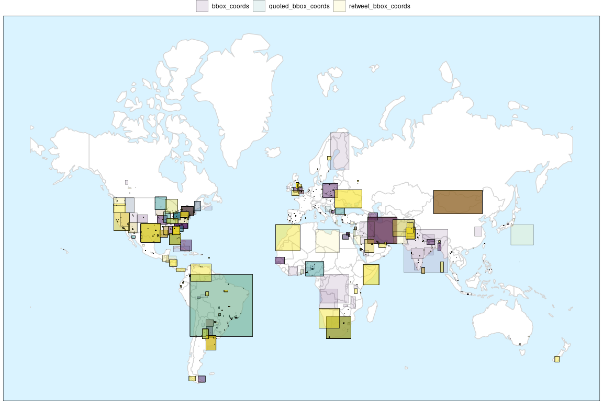

`{tweetio}`
================

  - [Introduction](#introduction)
  - [Installation](#installation)
  - [Usage](#usage)
      - [Simple Example](#simple-example)
      - [Performance](#performance)
      - [Data Dumps](#data-dumps)
  - [Spatial Tweets](#spatial-tweets)
  - [Tweet Networks](#tweet-networks)
      - [Two-Mode Networks](#two-mode-networks)
      - [`<proto_net>`](#proto_net)
  - [Progress](#progress)

<!-- README.Rmd generates README.md. -->

<!-- badges: start -->

[](https://www.tidyverse.org/lifecycle/#maturing)
[](https://ci.appveyor.com/project/knapply/tweetio)
[](https://travis-ci.org/knapply/tweetio)
[](https://codecov.io/gh/knapply/tweetio?branch=master)
[](https://github.com/knapply/tweetio/commits/master)
[](https://www.gnu.org/licenses/gpl-3.0)
[](https://www.r-project.org/)
<!-- [](http://hits.dwyl.io/knapply/tweetio) -->
<!-- badges: end -->

<!-- [](https://github.com/knapply/tweetio/actions?workflow=R-CMD-check) -->

# Introduction

`{tweetio}`’s goal is to enable safe, efficient I/O and transformation
of Twitter data. Whether the data came from the Twitter API, a database
dump, or some other source, `{tweetio}`’s job is to get them into R and
ready for analysis.

`{tweetio}` is **not** a competitor to
[`{rtweet}`](https://rtweet.info/): it is not interested in collecting
Twitter data. That said, it definitely attempts to compliment it by
emulating its data frame schema because…

1.  It’s incredibly easy to use.
2.  It’s more efficient to analyze than a key-value format following the
    raw data.
3.  It’d be a waste not to maximize compatibility with tools built
    specifically around `{rtweet}`’s data frames.

# Installation

You’ll need a C++ compiler. If you’re using Windows, that means
[Rtools](https://cran.r-project.org/bin/windows/Rtools/).

``` r
if (!requireNamespace("remotes", quietly = TRUE)) install.packages("remotes")

remotes::install_github("knapply/tweetio")
```

# Usage

``` r
library(tweetio)
```

`{tweetio}` uses
[`{data.table}`](https://rdatatable.gitlab.io/data.table/) internally
for performance and stability reasons, but if you’re a
[`{tidyverse}`](https://www.tidyverse.org/) fan who’s accustomed to
dealing with `tibble`s, you can set an option so that `tibble`s are
*always* returned.

Because `tibble`s have an incredibly informative and user-friendly
`print()` method, we’ll set the option for examples. Note that if the
`{tibble}` package is not installed, this option is ignored.

``` r
options(tweetio.as_tibble = TRUE)
```

You can check on all available `{tweetio}` options using
`tweetio_options()`.

``` r
tweetio_options()
```

    #> $tweetio.as_tibble
    #> [1] TRUE
    #> 
    #> $tweetio.verbose
    #> [1] FALSE

<!-- # What's New? -->

<!-- ## Easy Access to Twitter-disclosed Information Operations Archives -->

<!-- ```{r} -->

<!-- io_campaign_metadata -->

<!-- ``` -->

## Simple Example

First, we’ll save a stream of tweets using `rtweet::stream_tweets()`.

``` r
temp_file <- tempfile(fileext = ".json")
rtweet::stream_tweets(timeout = 15, parse = FALSE,
                      file_name = temp_file)
```

We can then pass the file path to `tweetio::read_tweets()` to
efficiently parse the data into an `{rtweet}`-style data frame.

``` r
tiny_rtweet_stream <- read_tweets(temp_file)
tiny_rtweet_stream
```

    #> # A tibble: 578 x 83
    #>    user_id status_id created_at          screen_name text  source reply_to_status… reply_to_user_id reply_to_screen… is_quote is_retweeted lang  name 
    #>    <chr>   <chr>     <dttm>              <chr>       <chr> <chr>  <chr>            <chr>            <chr>            <lgl>    <lgl>        <chr> <chr>
    #>  1 128920… 13062399… 2020-09-16 22:33:58 ksNu9acoLF… "كلا… "<a h… <NA>             <NA>             <NA>             FALSE    FALSE        ar    سلطا…
    #>  2 367853… 13062399… 2020-09-16 22:33:58 valeviscar… "RT … "<a h… <NA>             <NA>             <NA>             FALSE    FALSE        es    val  
    #>  3 953231… 13062399… 2020-09-16 22:33:58 yirees      "kan… "<a h… 130623961444154… 953231383        yirees           FALSE    FALSE        in    Leve…
    #>  4 124080… 13062399… 2020-09-16 22:33:58 oo3o_oo     "느헤헤… "<a h… <NA>             <NA>             <NA>             FALSE    FALSE        ko    베베 
    #>  5 126702… 13062399… 2020-09-16 22:33:58 nanaMG01    "RT … "<a h… <NA>             <NA>             <NA>             FALSE    FALSE        th    NANA…
    #>  6 110790… 13062399… 2020-09-16 22:33:58 r_rp352     "@na… "<a h… 130623805274697… 124776042561511… nao_cat_         FALSE    FALSE        und   黒兎 
    #>  7 125776… 13062399… 2020-09-16 22:33:58 tpwkforHar… "Hap… "<a h… <NA>             <NA>             <NA>             FALSE    FALSE        en    𝑺𝒂𝒗 …
    #>  8 283305… 13062399… 2020-09-16 22:33:58 1035aDbaf   "RT … "<a h… <NA>             <NA>             <NA>             FALSE    FALSE        ja    道産子Ａ…
    #>  9 814277… 13062399… 2020-09-16 22:33:58 bbrighttwi… "bri… "<a h… <NA>             <NA>             <NA>             FALSE    FALSE        in    moons
    #> 10 127674… 13062399… 2020-09-16 22:33:58 cloudcloud… "RT … "<a h… <NA>             <NA>             <NA>             FALSE    FALSE        ko    김려욱…
    #> # … with 568 more rows, and 70 more variables: location <chr>, description <chr>, url <chr>, protected <lgl>, followers_count <int>,
    #> #   friends_count <int>, listed_count <int>, statuses_count <int>, favourites_count <int>, account_created_at <dttm>, verified <lgl>,
    #> #   account_lang <chr>, profile_banner_url <chr>, profile_image_url <chr>, contributors_enabled <lgl>, hashtags <list>, urls_expanded_url <list>,
    #> #   media_url <list>, media_type <list>, mentions_user_id <list>, mentions_screen_name <list>, quoted_status_id <chr>, quoted_text <chr>,
    #> #   quoted_created_at <dttm>, quoted_source <chr>, quoted_favorite_count <int>, quoted_quoted_count <int>, quoted_user_id <chr>,
    #> #   quoted_screen_name <chr>, quoted_name <chr>, quoted_followers_count <int>, quoted_friends_count <int>, quoted_statuses_count <int>,
    #> #   quoted_location <chr>, quoted_description <chr>, retweet_status_id <chr>, retweet_text <chr>, retweet_created_at <dttm>, retweet_source <chr>,
    #> #   retweet_favorite_count <int>, retweet_retweet_count <int>, retweet_user_id <chr>, retweet_screen_name <chr>, retweet_name <chr>,
    #> #   retweet_followers_count <int>, retweet_friends_count <int>, retweet_statuses_count <int>, retweet_location <chr>, retweet_description <chr>,
    #> #   place_url <chr>, place_name <chr>, place_full_name <chr>, place_type <chr>, country <chr>, country_code <chr>, bbox_coords <list>,
    #> #   quoted_place_url <chr>, quoted_place_name <chr>, quoted_place_full_name <chr>, quoted_place_type <chr>, quoted_country <chr>,
    #> #   quoted_country_code <chr>, quoted_bbox_coords <list>, retweet_place_url <chr>, retweet_place_name <chr>, retweet_place_full_name <chr>,
    #> #   retweet_place_type <chr>, retweet_country <chr>, retweet_country_code <chr>, retweet_bbox_coords <list>

## Performance

`rtweet::parse_stream()` is totally sufficient for smaller files (as
long as the returned data are valid JSON), but `tweetio::read_tweets()`
is *much* faster.

``` r
small_rtweet_stream <- "inst/example-data/api-stream-small.json.gz"

res <- bench::mark(
  rtweet = rtweet::parse_stream(small_rtweet_stream),
  tweetio = tweetio::read_tweets(small_rtweet_stream)
  ,
  check = FALSE,
  filter_gc = FALSE,
  relative = TRUE
)

res[, 1:9]
```

    #> # A tibble: 2 x 6
    #>   expression   min median `itr/sec` mem_alloc `gc/sec`
    #>   <bch:expr> <dbl>  <dbl>     <dbl>     <dbl>    <dbl>
    #> 1 rtweet      35.1   33.0       1        79.2      Inf
    #> 2 tweetio      1      1        32.5       1        NaN

With bigger files, using `rtweet::parse_stream()` is no longer
realistic, especially if the JSON are invalid, but *big* tweet data sets
are where `{tweetio}` can help.

``` r
many_files <- dir("inst/example-data/", full.names = TRUE, recursive = TRUE)[1:10]
scales::number_bytes(sum(file.size(many_files)))
```

    #> [1] "705 MiB"

``` r
big_df <- read_tweets(many_files)
big_df
```

    #> # A tibble: 102,979 x 83
    #>    user_id status_id created_at          screen_name text  source reply_to_status… reply_to_user_id reply_to_screen… is_quote is_retweeted lang  name 
    #>    <chr>   <chr>     <dttm>              <chr>       <chr> <chr>  <chr>            <chr>            <chr>            <lgl>    <lgl>        <chr> <chr>
    #>  1 194250… 11780078… 2019-09-29 02:05:23 Stgo_centro "RT … "<a h… <NA>             <NA>             <NA>             FALSE    FALSE        es    El S…
    #>  2 825459… 11780078… 2019-09-29 02:05:24 taylorxkas… "RT … "<a h… <NA>             <NA>             <NA>             FALSE    FALSE        en    tayyy
    #>  3 218889… 11780078… 2019-09-29 02:05:24 markaduck   "@_C… "<a h… <NA>             3193408588       _CeeDeeThree     FALSE    FALSE        en    Mark…
    #>  4 401300… 11780078… 2019-09-29 02:05:25 unmario     "Fot… "<a h… <NA>             <NA>             <NA>             FALSE    FALSE        it    mari…
    #>  5 294908… 11780078… 2019-09-29 02:05:25 ALmardoza21 "@Es… "<a h… 117782418292045… 107959364313085… EsrodKatia       FALSE    FALSE        und   Ana …
    #>  6 111622… 11780078… 2019-09-29 02:05:27 singhbhrme… "RT … "<a h… <NA>             <NA>             <NA>             FALSE    FALSE        hi    भरमे… 
    #>  7 231344… 11780078… 2019-09-29 02:05:27 barbimoral… "Mi … "<a h… <NA>             <NA>             <NA>             FALSE    FALSE        es    bárb…
    #>  8 437465… 11780078… 2019-09-29 02:05:27 javii_sotoo "RT … "<a h… <NA>             <NA>             <NA>             TRUE     FALSE        en    Javi 
    #>  9 117288… 11780078… 2019-09-29 02:05:29 nLfRH1      "RT … "<a h… <NA>             <NA>             <NA>             FALSE    FALSE        ar    سما …
    #> 10 113247… 11780078… 2019-09-29 02:05:30 bexxxv97    "RT … "<a h… <NA>             <NA>             <NA>             FALSE    FALSE        en    Becc…
    #> # … with 102,969 more rows, and 70 more variables: location <chr>, description <chr>, url <chr>, protected <lgl>, followers_count <int>,
    #> #   friends_count <int>, listed_count <int>, statuses_count <int>, favourites_count <int>, account_created_at <dttm>, verified <lgl>,
    #> #   account_lang <chr>, profile_banner_url <chr>, profile_image_url <chr>, contributors_enabled <lgl>, hashtags <list>, urls_expanded_url <list>,
    #> #   media_url <list>, media_type <list>, mentions_user_id <list>, mentions_screen_name <list>, quoted_status_id <chr>, quoted_text <chr>,
    #> #   quoted_created_at <dttm>, quoted_source <chr>, quoted_favorite_count <int>, quoted_quoted_count <int>, quoted_user_id <chr>,
    #> #   quoted_screen_name <chr>, quoted_name <chr>, quoted_followers_count <int>, quoted_friends_count <int>, quoted_statuses_count <int>,
    #> #   quoted_location <chr>, quoted_description <chr>, retweet_status_id <chr>, retweet_text <chr>, retweet_created_at <dttm>, retweet_source <chr>,
    #> #   retweet_favorite_count <int>, retweet_retweet_count <int>, retweet_user_id <chr>, retweet_screen_name <chr>, retweet_name <chr>,
    #> #   retweet_followers_count <int>, retweet_friends_count <int>, retweet_statuses_count <int>, retweet_location <chr>, retweet_description <chr>,
    #> #   place_url <chr>, place_name <chr>, place_full_name <chr>, place_type <chr>, country <chr>, country_code <chr>, bbox_coords <list>,
    #> #   quoted_place_url <chr>, quoted_place_name <chr>, quoted_place_full_name <chr>, quoted_place_type <chr>, quoted_country <chr>,
    #> #   quoted_country_code <chr>, quoted_bbox_coords <list>, retweet_place_url <chr>, retweet_place_name <chr>, retweet_place_full_name <chr>,
    #> #   retweet_place_type <chr>, retweet_country <chr>, retweet_country_code <chr>, retweet_bbox_coords <list>

## Data Dumps

A common practice for handling social media data at scale is to store
them in search engine databases like Elasticsearch, but it’s
(unfortunately) possible that you’ll need to work with data dumps.

This has three unfortunate consequences:

1.  Routines that were purpose-built to work directly with `{rtweet}`’s
    data frames can’t play along with your data.
2.  You’re going to waste most of your time (and memory) getting data
    into R that you’re not going to use.
3.  The data are *very* tedious to restructure in R (lists of lists of
    lists of lists of lists…).

`{tweetio}` solves this by parsing everything and building the data
frames at the C++ level, including handling GZIP files for you.

# Spatial Tweets

If you have `{sf}` installed, you can use `as_tweet_sf()` to only keep
those tweets that contain valid bounding box polygons or points.

``` r
tweet_sf <- as_tweet_sf(big_df)
tweet_sf[, "geometry"]
```

    #> Simple feature collection with 2140 features and 0 fields
    #> geometry type:  POLYGON
    #> dimension:      XY
    #> bbox:           xmin: -157.9505 ymin: -55.11686 xmax: 150.4919 ymax: 70.09222
    #> CRS:            EPSG:4326
    #> # A tibble: 2,140 x 1
    #>                                                                                        geometry
    #>                                                                                   <POLYGON [°]>
    #>  1 ((-97.51982 35.15327, -97.51982 35.29133, -97.37053 35.29133, -97.37053 35.15327, -97.519...
    #>  2 ((8.665852 44.37908, 8.665852 44.51991, 9.095838 44.51991, 9.095838 44.37908, 8.665852 44...
    #>  3 ((-106.9506 31.12068, -106.9506 31.78387, -106.1854 31.78387, -106.1854 31.12068, -106.95...
    #>  4 ((-63.39386 -41.03501, -63.39386 -33.26014, -56.66584 -33.26014, -56.66584 -41.03501, -63...
    #>  5 ((30.42998 39.76794, 30.42998 39.80569, 30.55928 39.80569, 30.55928 39.76794, 30.42998 39...
    #>  6 ((-118.6684 33.70454, -118.6684 34.33704, -118.1554 34.33704, -118.1554 33.70454, -118.66...
    #>  7 ((139.136 36.24259, 139.136 36.4086, 139.2828 36.4086, 139.2828 36.24259, 139.136 36.24259))
    #>  8 ((135.5633 34.68448, 135.5633 34.7202, 135.6046 34.7202, 135.6046 34.68448, 135.5633 34.6...
    #>  9 ((-119.0618 34.12687, -119.0618 34.25008, -118.776 34.25008, -118.776 34.12687, -119.0618...
    #> 10 ((-63.78454 -35.6894, -63.78454 -35.64174, -63.72472 -35.64174, -63.72472 -35.6894, -63.7...
    #> # … with 2,130 more rows

There are currently four columns that can potentially hold spatial
geometries:

1.  `"bbox_coords"`
2.  `"quoted_bbox_coords"`
3.  `"retweet_bbox_coords"`
4.  `"geo_coords"`

You can select which one to use to build your `sf` object by modifying
the `geom_col=` parameter (default: `"bbox_coords"`)

``` r
as_tweet_sf(big_df, geom_col = "retweet_bbox_coords")[, "geometry"]
```

    #> Simple feature collection with 2377 features and 0 fields
    #> geometry type:  POLYGON
    #> dimension:      XY
    #> bbox:           xmin: -124.849 ymin: -54.64819 xmax: 171.1442 ymax: 63.99495
    #> CRS:            EPSG:4326
    #> # A tibble: 2,377 x 1
    #>                                                                                        geometry
    #>                                                                                   <POLYGON [°]>
    #>  1 ((-70.63769 -33.44997, -70.63769 -33.409, -70.58383 -33.409, -70.58383 -33.44997, -70.637...
    #>  2 ((-80.51985 39.7198, -80.51985 42.51607, -74.68952 42.51607, -74.68952 39.7198, -80.51985...
    #>  3 ((92.21025 6.760443, 92.21025 13.6849, 94.27577 13.6849, 94.27577 6.760443, 92.21025 6.76...
    #>  4 ((0.010398 51.54382, 0.010398 51.62617, 0.147328 51.62617, 0.147328 51.54382, 0.010398 51...
    #>  5 ((46.3044 24.33207, 46.3044 25.11182, 47.06576 25.11182, 47.06576 24.33207, 46.3044 24.33...
    #>  6 ((-115.3841 36.12946, -115.3841 36.33637, -115.0622 36.33637, -115.0622 36.12946, -115.38...
    #>  7 ((-82.66356 34.77603, -82.66356 34.89144, -82.47644 34.89144, -82.47644 34.77603, -82.663...
    #>  8 ((-122.7792 38.39678, -122.7792 38.50766, -122.573 38.50766, -122.573 38.39678, -122.7792...
    #>  9 ((80.12507 26.17718, 80.12507 26.63457, 80.56706 26.63457, 80.56706 26.17718, 80.12507 26...
    #> 10 ((-46.56728 -23.81592, -46.56728 -23.60562, -46.27811 -23.60562, -46.27811 -23.81592, -46...
    #> # … with 2,367 more rows

You can also build *all* the supported bounding boxes by setting
`geom_col=` to `"all"`.

``` r
all_bboxes <- as_tweet_sf(big_df, geom_col = "all")
all_bboxes[, c("which_geom", "geometry")]
```

    #> Simple feature collection with 5042 features and 1 field
    #> geometry type:  POLYGON
    #> dimension:      XY
    #> bbox:           xmin: -157.9505 ymin: -55.11686 xmax: 150.4919 ymax: 70.09222
    #> CRS:            EPSG:4326
    #> # A tibble: 5,042 x 2
    #>    which_geom                                                                                      geometry
    #>    <chr>                                                                                      <POLYGON [°]>
    #>  1 bbox_coords ((-97.51982 35.15327, -97.51982 35.29133, -97.37053 35.29133, -97.37053 35.15327, -97.519...
    #>  2 bbox_coords ((8.665852 44.37908, 8.665852 44.51991, 9.095838 44.51991, 9.095838 44.37908, 8.665852 44...
    #>  3 bbox_coords ((-106.9506 31.12068, -106.9506 31.78387, -106.1854 31.78387, -106.1854 31.12068, -106.95...
    #>  4 bbox_coords ((-63.39386 -41.03501, -63.39386 -33.26014, -56.66584 -33.26014, -56.66584 -41.03501, -63...
    #>  5 bbox_coords ((30.42998 39.76794, 30.42998 39.80569, 30.55928 39.80569, 30.55928 39.76794, 30.42998 39...
    #>  6 bbox_coords ((-118.6684 33.70454, -118.6684 34.33704, -118.1554 34.33704, -118.1554 33.70454, -118.66...
    #>  7 bbox_coords ((139.136 36.24259, 139.136 36.4086, 139.2828 36.4086, 139.2828 36.24259, 139.136 36.24259))
    #>  8 bbox_coords ((135.5633 34.68448, 135.5633 34.7202, 135.6046 34.7202, 135.6046 34.68448, 135.5633 34.6...
    #>  9 bbox_coords ((-119.0618 34.12687, -119.0618 34.25008, -118.776 34.25008, -118.776 34.12687, -119.0618...
    #> 10 bbox_coords ((-63.78454 -35.6894, -63.78454 -35.64174, -63.72472 -35.64174, -63.72472 -35.6894, -63.7...
    #> # … with 5,032 more rows

From there, you can easily use the data like any other `{sf}` object.

``` r
library(ggplot2)

world <- rnaturalearth::ne_countries(returnclass = "sf")
world <- world[world$continent != "Antarctica", ]

all_bboxes <- all_bboxes[order(sf::st_area(all_bboxes$geometry), decreasing = TRUE), ]

ggplot(all_bboxes) +
  geom_sf(fill = "white", color = "lightgray", data = world) +
  geom_sf(aes(fill = which_geom), color = "black" ,
          alpha = 0.1, size = 0.1, show.legend = TRUE) +
  coord_sf(crs = 3857) +
  scale_fill_viridis_d() +
  scale_color_viridis_d() +
  theme_void() +
  theme(legend.title = element_blank(), legend.position = "top",
        panel.background = element_rect(fill = "#daf3ff"))
```



# Tweet Networks

If you want to analyze tweet networks and have `{igraph}` or `{network}`
installed, you can get started immediately using
`tweetio::as_tweet_igraph()` or `tweetio::as_tweet_network()`.

``` r
for_network <- big_df[1:1e4, ]

as_tweet_igraph(big_df)
```

    #> IGRAPH 0b1cffe DN-- 111402 155439 -- 
    #> + attr: name (v/c), status_id (e/c), created_at (e/n), relation (e/c)
    #> + edges from 0b1cffe (vertex names):
    #>  [1] 194250838          ->340309688           825459487821619201 ->966825602           1116228559616397312->3153145782         
    #>  [4] 4374655520         ->4167284315          1172885625068036102->1112877891841343488 1132474594583928832->1217220278         
    #>  [7] 20737729           ->39334221            2198859787         ->3096758526          3237877098         ->847885187325276164 
    #> [10] 868219009350676481 ->1962155772          2374444356         ->772252481581645824  1128846892966850560->374194112          
    #> [13] 1121455512283832320->1052159172          1165554985406304257->1066731959311728640 796800573840523264 ->891730158490722304 
    #> [16] 880220664031924224 ->471677441           751878817678000129 ->84810629            1177166063710035968->729291120484581376 
    #> [19] 979945309370572800 ->20003409            110467298          ->1052177850793676800 1030905816         ->214868647          
    #> [22] 3238940403         ->2837160270          1177725296306540545->1005566329577930752 4079051113         ->2572844671         
    #> + ... omitted several edges

``` r
as_tweet_network(for_network)
```

    #>  Network attributes:
    #>   vertices = 16693 
    #>   directed = TRUE 
    #>   hyper = FALSE 
    #>   loops = TRUE 
    #>   multiple = TRUE 
    #>   bipartite = FALSE 
    #>   total edges= 17912 
    #>     missing edges= 0 
    #>     non-missing edges= 17912 
    #> 
    #>  Vertex attribute names: 
    #>     vertex.names 
    #> 
    #>  Edge attribute names not shown

If you want to take advantage of all the metadata available, you can set
`all_status_data` and/or `all_user_data` to `TRUE`

``` r
as_tweet_igraph(big_df,
                all_user_data = TRUE, all_status_data = TRUE)
```

    #> IGRAPH d3d2530 DN-- 111402 155439 -- 
    #> + attr: name (v/c), timestamp_ms (v/n), name.y (v/c), screen_name (v/c), location (v/c), description (v/c), url (v/c), protected
    #> | (v/l), followers_count (v/n), friends_count (v/n), listed_count (v/n), statuses_count (v/n), favourites_count (v/n),
    #> | account_created_at (v/n), verified (v/l), account_lang (v/c), profile_banner_url (v/c), profile_image_url (v/c), bbox_coords (v/x),
    #> | status_id (e/c), created_at (e/n), relation (e/c), text (e/c), i.created_at (e/n), source (e/c), is_quote (e/l), is_retweeted (e/l),
    #> | media_url (e/x), media_type (e/x), place_url (e/c), place_name (e/c), place_full_name (e/c), place_type (e/c), country (e/c),
    #> | country_code (e/c), bbox_coords (e/x), status_type (e/c)
    #> + edges from d3d2530 (vertex names):
    #>  [1] 426958963          ->104190846           426958963          ->104190846           426958963          ->16312576           
    #>  [4] 1127426916984639493->744853406           1127426916984639493->744853406           4809076840         ->1090715513586679813
    #>  [7] 4809076840         ->1090715513586679813 2581447536         ->433041189           2581447536         ->3697993936         
    #> + ... omitted several edges

``` r
as_tweet_network(for_network,
                 all_user_data = TRUE, all_status_data = TRUE)
```

    #>  Network attributes:
    #>   vertices = 16693 
    #>   directed = TRUE 
    #>   hyper = FALSE 
    #>   loops = TRUE 
    #>   multiple = TRUE 
    #>   bipartite = FALSE 
    #>   total edges= 17912 
    #>     missing edges= 0 
    #>     non-missing edges= 17912 
    #> 
    #>  Vertex attribute names: 
    #>     account_created_at account_lang bbox_coords description favourites_count followers_count friends_count listed_count location name.y profile_banner_url profile_image_url protected screen_name statuses_count timestamp_ms url verified vertex.names 
    #> 
    #>  Edge attribute names not shown

## Two-Mode Networks

You can also build two-mode networks by specifying the `target_class` as
`"hashtag"`s, `"url"`s, or `"media"`.

  - Returned `<igraph>`s will be set as bipartite following `{igraph}`’s
    convention of a `logical` vertex attribute specifying each
    partition. Accounts are always `TRUE`.
  - Returned `<network>`s will be set as bipartite following
    `{network}`’s convention of ordering the “actors” first, and
    setting the network-level attribute of “bipartite” as the number of
    “actors”. Accounts are always the “actors”.

If bipartite, the returned objects are always set as undirected.

### Users to Hashtags

``` r
as_tweet_igraph(big_df, target_class = "hashtag")
```

    #> IGRAPH 4a67dcc UN-B 32019 39563 -- 
    #> + attr: name (v/c), type (v/l), status_id (e/c), created_at (e/n), relation (e/c)
    #> + edges from 4a67dcc (vertex names):
    #>  [1] 218889555          --sooners               93732206           --conejopride           93732206           --inclusionishappening 
    #>  [4] 93732206           --ireadbannedbooks      1165554985406304257--ป๋อจ้าน                 1270106738         --theboss              
    #>  [7] 1270106738         --jefa                  1270106738         --nahreptop250          1270106738         --nahrep               
    #> [10] 1270106738         --olivaresandmolinateam 1270106738         --realtors              1270106738         --realestate           
    #> [13] 1270106738         --sandiego              1065721261744107521--45jornadas            1065721261744107521--ushuaia              
    #> [16] 1177166063710035968--จับโป๊ะโดมปฏิวัติ          979945309370572800 --barawe                979945309370572800 --somali               
    #> [19] 110467298          --autumn                110467298          --crocus                110467298          --friuliveneziagiulia  
    #> [22] 1177725296306540545--fridaysforfuture      16429082           --nnba2019              16429082           --nursesinbusiness     
    #> + ... omitted several edges

``` r
as_tweet_network(for_network, target_class = "hashtag")
```

    #>  Network attributes:
    #>   vertices = 3682 
    #>   directed = FALSE 
    #>   hyper = FALSE 
    #>   loops = FALSE 
    #>   multiple = TRUE 
    #>   bipartite = 1443 
    #>   total edges= 3294 
    #>     missing edges= 0 
    #>     non-missing edges= 3294 
    #> 
    #>  Vertex attribute names: 
    #>     vertex.names 
    #> 
    #>  Edge attribute names not shown

### Users to URLs

``` r
as_tweet_igraph(big_df, target_class = "url")
```

    #> IGRAPH 0bf42d5 UN-B 21750 11882 -- 
    #> + attr: name (v/c), type (v/l), status_id (e/c), created_at (e/n), relation (e/c)
    #> + edges from 0bf42d5 (vertex names):
    #>  [1] 401300296          --https://www.instagram.com/p/B29ty1WI8Hq/?igshid=r8cvay5bcd2b                             
    #>  [2] 4374655520         --https://twitter.com/richie_ixii/status/1173141471186300928                               
    #>  [3] 2198859787         --https://twitter.com/_trapicuI/status/1172934868155674624                                 
    #>  [4] 3237877098         --http://M.Tech                                                                            
    #>  [5] 93732206           --https://twitter.com/i/web/status/1178007867770597377                                     
    #>  [6] 1362794708         --https://twitter.com/i/web/status/1178007876159324162                                     
    #>  [7] 2204772030         --https://www.instagram.com/p/B29tyfugf-mHs-EFtcjrmdoEpMIZ3XAPG-dAVM0/?igshid=19fimm21fwfcs
    #>  [8] 1270106738         --https://www.instagram.com/p/B29t0pfj69T/?igshid=1fdcpeqtaynr3                            
    #> + ... omitted several edges

``` r
as_tweet_network(for_network, target_class = "url")
```

    #>  Network attributes:
    #>   vertices = 3063 
    #>   directed = FALSE 
    #>   hyper = FALSE 
    #>   loops = FALSE 
    #>   multiple = TRUE 
    #>   bipartite = 1548 
    #>   total edges= 1582 
    #>     missing edges= 0 
    #>     non-missing edges= 1582 
    #> 
    #>  Vertex attribute names: 
    #>     vertex.names 
    #> 
    #>  Edge attribute names not shown

### Users to Media

``` r
as_tweet_igraph(big_df, target_class = "media")
```

    #> IGRAPH a3ca790 UN-B 21119 11767 -- 
    #> + attr: name (v/c), type (v/l), status_id (e/c), created_at (e/n), relation (e/c)
    #> + edges from a3ca790 (vertex names):
    #>  [1] 1172885625068036102--http://pbs.twimg.com/media/EFjoYwdXoAIMNDQ.jpg                                         
    #>  [2] 1132474594583928832--http://pbs.twimg.com/ext_tw_video_thumb/1177736533094256640/pu/img/dAM2VWRBvvoZHzOT.jpg
    #>  [3] 93732206           --http://pbs.twimg.com/ext_tw_video_thumb/1178007795150360577/pu/img/uJsh5Y-vTStma7Xa.jpg
    #>  [4] 1121455512283832320--http://pbs.twimg.com/media/EFhtCsZUcAAWBA4.jpg                                         
    #>  [5] 1065721261744107521--http://pbs.twimg.com/media/EFkf8M8W4AAIbwI.jpg                                         
    #>  [6] 1065721261744107521--http://pbs.twimg.com/media/EFkf8M9XkAA_U-N.jpg                                         
    #>  [7] 1065721261744107521--http://pbs.twimg.com/media/EFkf8i9WkAE96x1.jpg                                         
    #>  [8] 1042911305202454528--http://pbs.twimg.com/media/EFkf-xWUwAEl_DH.jpg                                         
    #> + ... omitted several edges

``` r
as_tweet_network(for_network, target_class = "media")
```

    #>  Network attributes:
    #>   vertices = 4351 
    #>   directed = FALSE 
    #>   hyper = FALSE 
    #>   loops = FALSE 
    #>   multiple = TRUE 
    #>   bipartite = 2199 
    #>   total edges= 2284 
    #>     missing edges= 0 
    #>     non-missing edges= 2284 
    #> 
    #>  Vertex attribute names: 
    #>     vertex.names 
    #> 
    #>  Edge attribute names not shown

## `<proto_net>`

You’re not stuck with going directly to `<igraph>`s or `<network>`s
though. Underneath the hood, `as_tweet_igraph()` and
`as_tweet_network()` use `as_proto_net()` to build a `<proto_net>`, a
list of edge and node data frames.

``` r
as_proto_net(big_df,
             all_status_data = TRUE, all_user_data = TRUE)
```

    #> $edges
    #> # A tibble: 155,439 x 20
    #>    from  to    status_id created_at          relation text  i.created_at        source is_quote is_retweeted media_url media_type place_url place_name
    #>    <chr> <chr> <chr>     <dttm>              <chr>    <chr> <dttm>              <chr>  <lgl>    <lgl>        <list>    <list>     <chr>     <chr>     
    #>  1 4269… 1041… 12784859… 2020-07-02 08:29:32 retweet  "RT … 2020-07-02 08:29:32 "<a h… TRUE     FALSE        <chr [1]> <chr [1]>  <NA>      <NA>      
    #>  2 4269… 1041… 12784859… 2020-07-02 08:29:32 mentions "RT … 2020-07-02 08:29:32 "<a h… TRUE     FALSE        <chr [1]> <chr [1]>  <NA>      <NA>      
    #>  3 4269… 1631… 12784859… 2020-07-02 08:29:32 mentions "RT … 2020-07-02 08:29:32 "<a h… TRUE     FALSE        <chr [1]> <chr [1]>  <NA>      <NA>      
    #>  4 1127… 7448… 12784859… 2020-07-02 08:29:31 retweet  "RT … 2020-07-02 08:29:31 "<a h… TRUE     FALSE        <chr [1]> <chr [1]>  <NA>      <NA>      
    #>  5 1127… 7448… 12784859… 2020-07-02 08:29:31 mentions "RT … 2020-07-02 08:29:31 "<a h… TRUE     FALSE        <chr [1]> <chr [1]>  <NA>      <NA>      
    #>  6 4809… 1090… 12784859… 2020-07-02 08:29:31 retweet  "RT … 2020-07-02 08:29:31 "<a h… TRUE     FALSE        <chr [1]> <chr [1]>  <NA>      <NA>      
    #>  7 4809… 1090… 12784859… 2020-07-02 08:29:31 mentions "RT … 2020-07-02 08:29:31 "<a h… TRUE     FALSE        <chr [1]> <chr [1]>  <NA>      <NA>      
    #>  8 2581… 4330… 12784859… 2020-07-02 08:29:28 retweet  "RT … 2020-07-02 08:29:28 "<a h… TRUE     FALSE        <chr [1]> <chr [1]>  <NA>      <NA>      
    #>  9 2581… 3697… 12784859… 2020-07-02 08:29:28 quoted   "RT … 2020-07-02 08:29:28 "<a h… TRUE     FALSE        <chr [1]> <chr [1]>  <NA>      <NA>      
    #> 10 2581… 4330… 12784859… 2020-07-02 08:29:28 mentions "RT … 2020-07-02 08:29:28 "<a h… TRUE     FALSE        <chr [1]> <chr [1]>  <NA>      <NA>      
    #> # … with 155,429 more rows, and 6 more variables: place_full_name <chr>, place_type <chr>, country <chr>, country_code <chr>, bbox_coords <list>,
    #> #   status_type <chr>
    #> 
    #> $nodes
    #> # A tibble: 111,402 x 19
    #>    name  timestamp_ms name.y screen_name location description url   protected followers_count friends_count listed_count statuses_count
    #>    <chr>        <dbl> <chr>  <chr>       <chr>    <chr>       <chr> <lgl>               <int>         <int>        <int>          <int>
    #>  1 1000…   1593645842 Actio… ACF_EU      "Brusse… "A global … <NA>  FALSE                 557           463           10            746
    #>  2 1000…   1593660413 <NA>   Cryptogal3   <NA>     <NA>       <NA>  NA                     NA            NA           NA             NA
    #>  3 1000…   1593471008 Lil_P… arowoogun_… "Worldw… "||•MUFC |… <NA>  FALSE                1146          1147            2           7417
    #>  4 1000…   1569723256 ©️0️⃣STA  _costinhaaa "Portug… "CERCI BOY… <NA>  NA                    262           256           NA           2477
    #>  5 1000…   1593630716 jay    farhanjml    <NA>    "you're my… <NA>  FALSE                 119           497            0           6937
    #>  6 1000…   1593588004 🇵🇸سبح… falahghafa…  <NA>    "« Le cœur… <NA>  FALSE                1636          1574            0          71481
    #>  7 1000…   1593461581 Crypt… Tera_kev    "Hessen… "http://te… <NA>  FALSE                 204           149            1           6318
    #>  8 1000…   1593032739 taegi… outroskjta… "louღta… "#𝙔𝙊𝙊𝙉𝙂𝙄:𝙀… <NA>  FALSE                 422           462            5          27392
    #>  9 1000…   1593557897 Misae… McSonk      "México" "#develope… http… FALSE                 224           381            1          18411
    #> 10 1000…   1569723012 Maria… mariana_rgr  <NA>     <NA>       <NA>  NA                    118           113           NA           1169
    #> # … with 111,392 more rows, and 7 more variables: favourites_count <int>, account_created_at <dbl>, verified <lgl>, account_lang <chr>,
    #> #   profile_banner_url <chr>, profile_image_url <chr>, bbox_coords <list>
    #> 
    #> attr(,"class")
    #> [1] "proto_net"
    #> attr(,"target_class")
    #> [1] "user"

# Progress

### Supported Data Inputs

  - [x] Twitter Streaming API (NDJSON/JSONL)
  - [x] Twitter REST API (/statuses)
  - [x] API to Elasticsearch-style document arrays (`/_source/doc`)
  - [x] API to Elasticsearch-style NDJSON/JSONL (`/doc`)

### Supported Data Outputs

  - [x] CSV
  - [x] Gephi-friendly GraphML

### Structures

  - [x] `{rtweet}`-style data frames
  - [x] Spatial Tweets via `{sf}`
  - [x] Tweet networks via `{igraph}`
  - [x] Tweet networks via `{network}`
